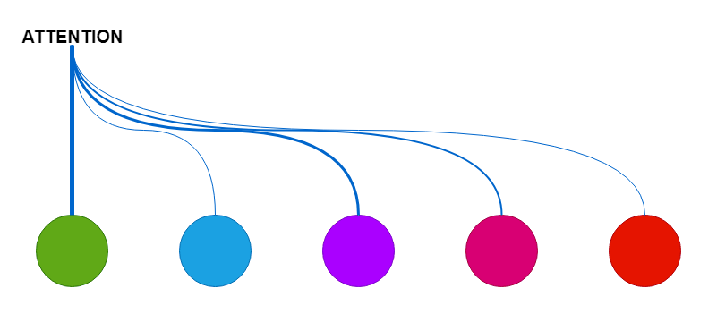
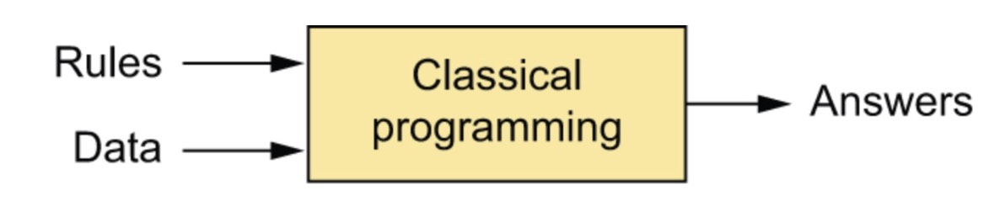
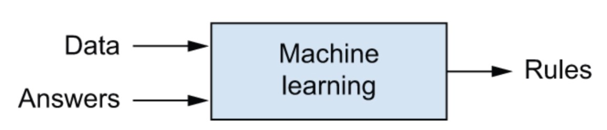
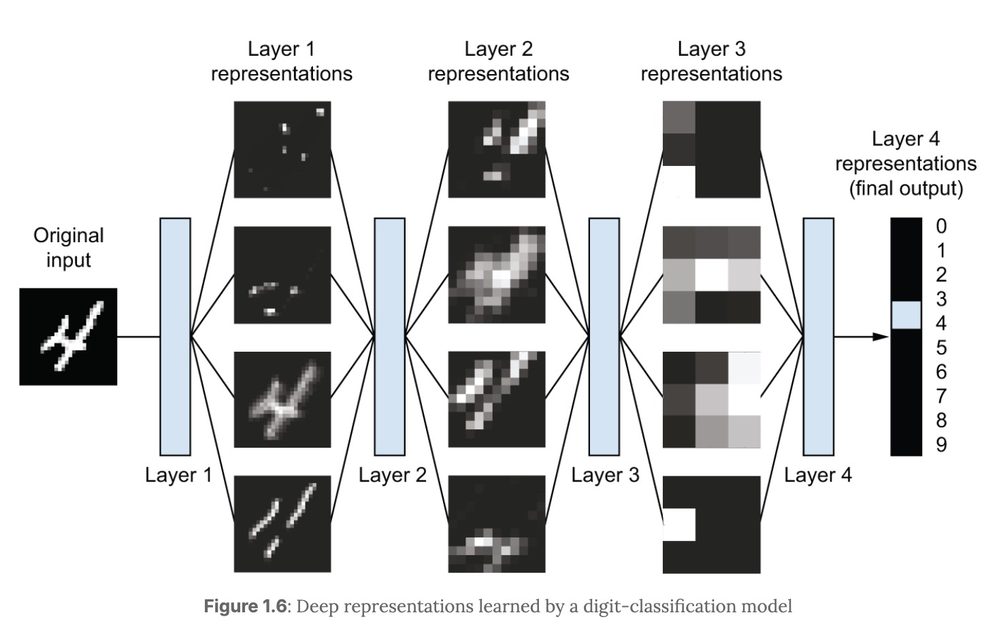

# From Static to Dynamic Weights



---

## 1. The Core Question of Deep Learning

At the center of machine learning lies a very simple question:

> How do we map inputs to outputs?

Formally, we want to learn a function:

$$
y = f(x)
$$

Everything in deep learning, from linear regression to large language models, is ultimately an attempt to approximate this mapping.

But there is a deeper question hidden underneath:

> What exactly is being learned inside $f$?

More specifically:

> What is the nature of the weights that define this function?

---

## 2. Level 1: No Learning, Only Rules



Before machine learning, we relied on explicit rules written by humans.

```python
def classify_fruit(weight, color_score):
    if weight > 100 and color_score > 0.7:
        return "apple"
    else:
        return "orange"
```

This is pure hand-crafted logic:

* No learning
* No adaptation
* No parameters to optimize

The system behaves exactly as specified.

This approach breaks down when:

* The rules become too complex to write
* The structure of the data is not obvious
* We have large-scale, high-dimensional inputs

---

## 3. Level 2: Static Weights



Neural networks introduce a fundamental shift: instead of writing rules, we learn parameters from data.

### A Simple Neural Network

A typical multi-layer perceptron can be written as:

$$
y = \text{ReLU}(x W_1 + b_1) W_2 + b_2
$$

Here:

* $W_1, W_2$ are learned from data
* After training, they are fixed
* The same weights are applied to every input

This is the key property:

> The computation changes the data, but not the weights.

Once training is complete, the model becomes a fixed function.

*Further reading (optional refresher on the “learned-but-fixed weights” view of deep learning):*

- https://deeplearningwithpython.io/chapters/chapter01_what-is-deep-learning/


---

## 4. The Limitation of Static Weights




Static weights work well when patterns are globally consistent.

But they struggle when meaning depends on context.

Consider:

> "This movie was not good, it was absolutely fantastic!"

A fixed-weight model may treat:

* "not" as negative
* "good" as positive
* "fantastic" as positive

But it cannot easily adjust how these signals interact dynamically across the sentence.

The core limitation is:

* Each feature has a fixed meaning
* The model cannot decide what to focus on at inference time

In other words:

> The computation is static even when the input is complex.

---

## 5. Level 3: Dynamic Weights

This leads to a fundamental idea:

> What if weights are not fixed after training, but generated from the input itself?

Instead of:

$$
y = \sum_i w_i \cdot x_i
$$

we move to:

$$
y = \sum_i \alpha_i(x) \cdot x_i
$$

Now the weights depend on the input:

* $x$ determines $\alpha_i(x)$
* different inputs produce different weighting schemes

This is a structural change:

> The model does not just compute on data. It **reconfigures itself based on data**.
