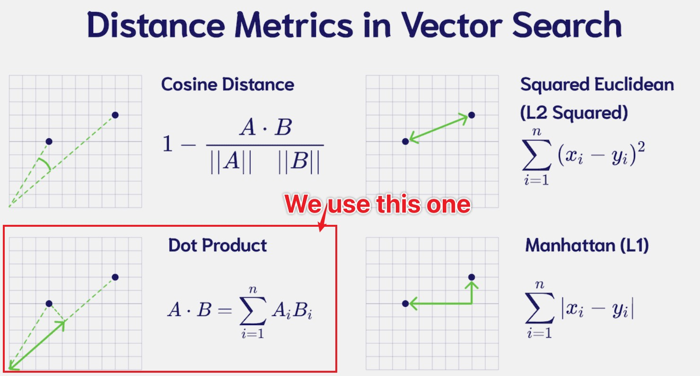
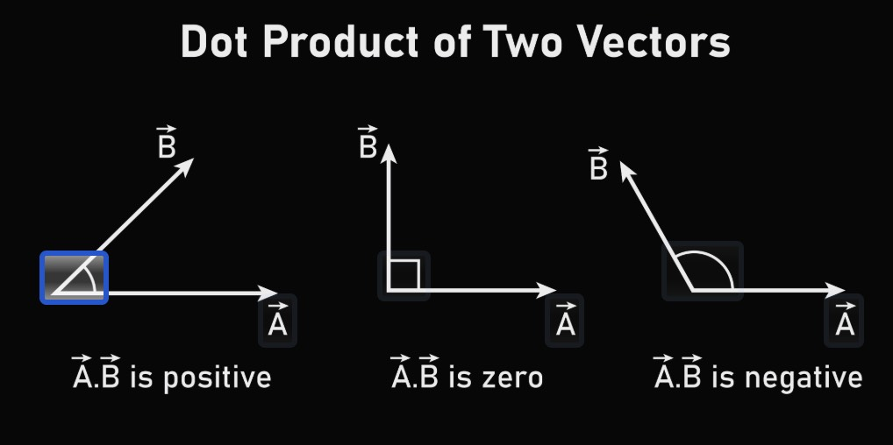

# Dot Product as Similarity




---

## 1. Why Do We Use the Dot Product?

In attention, the core operation is the dot product:

$$
q_i \cdot k_j
$$

which gives the raw compatibility score before scaling.

After scaling by $\sqrt{d_k}$, the score is:

$$
s_{ij} = \frac{q_i \cdot k_j}{\sqrt{d_k}}
$$

This defines how much query $q_i$ matches key $k_j$.

The question is:

> Why is the dot product a good measure of similarity?

---

## 2. Algebraic View

The dot product is defined as:

$$
q \cdot k = \sum_{f=0}^{d_k-1} q_f k_f
$$

It measures the **alignment** between two vectors.

* Large positive value → strong alignment
* Near zero → weak or no alignment
* Negative value → opposite directions

---

## 3. Geometric Interpretation




The dot product can be written as:

$$
q \cdot k = |q| \, |k| \cos \theta
$$

where $\theta$ is the angle between the vectors.

This shows:

* Similar direction → $\cos \theta \approx 1$
* Orthogonal → $\cos \theta \approx 0$
* Opposite → $\cos \theta \approx -1$

---

## 4. Connection to Similarity

If we normalize vectors:

$$
|q| = |k| = 1
$$

then:

$$
q \cdot k = \cos \theta
$$

So the dot product becomes **cosine similarity**.

Even without normalization, it still captures both:

* Direction (angle)
* Magnitude (confidence or strength)

---

## 5. Why It Works Well in Attention

The dot product has several advantages:

* Efficient: matrix multiplication computes all pairwise scores
* Differentiable: suitable for gradient-based learning
* Scalable: works well in high dimensions

In matrix form:

$$
S = Q K^T
$$

computes all similarities in parallel.

---

## 6. Interaction with Scaling

As discussed previously:

$$
S = \frac{Q K^T}{\sqrt{d_k}}
$$

Scaling ensures that dot product magnitudes remain stable as dimension increases.

---

## 7. Alternative Similarity Functions


Other similarity measures exist:

* Cosine similarity
* Additive (MLP-based) attention
* Euclidean distance

However, the dot product is preferred in Transformers because it:

* Integrates naturally with linear algebra
* Enables highly optimized implementations


---

## 8. NumPy Implementation Guide

### 8.1 Dot Product and Cosine Similarity in NumPy

```python
import numpy as np

# Define two vectors (as row vectors per our convention)
a = np.array([[1, 2, 3]])      # shape: (1, 3)
b = np.array([[4, 5, 6]])      # shape: (1, 3)

# Method 1: Using np.dot
dot_product = np.dot(a, b.T)   # shape: (1, 1)
print(f"Dot product (np.dot): {dot_product[0, 0]}")

# Method 2: Using @ operator (Python 3.5+)
dot_product = a @ b.T          # shape: (1, 1)
print(f"Dot product (@): {dot_product[0, 0]}")

# Method 3: Using np.sum with element-wise multiplication
dot_product = np.sum(a * b)    # element-wise then sum
print(f"Dot product (sum): {dot_product}")

# Cosine similarity
def cosine_similarity(a, b):
    """Compute cosine similarity between two row vectors."""
    dot = a @ b.T
    norm_a = np.linalg.norm(a)
    norm_b = np.linalg.norm(b)
    return dot / (norm_a * norm_b)

cos_sim = cosine_similarity(a, b)
print(f"Cosine similarity: {cos_sim[0, 0]:.4f}")
```

### 8.2 NumPy Multiplication Operations Cheat Sheet

| Operation | Function/Operator | Description | Example | Output Shape |
|-----------|-------------------|-------------|---------|--------------|
| **Dot Product** | `np.dot(a, b)` or `a @ b` | Matrix multiplication (follows linear algebra rules) | `(3,) @ (3,)` → scalar; `(2,3) @ (3,4)` → `(2,4)` | `(m,n) @ (n,p) → (m,p)` |
| **Matrix Multiply** | `np.matmul(a, b)` or `a @ b` | Strict matrix multiplication, supports broadcasting | Same as `np.dot` for 2D arrays | Same as above |
| **Element-wise** | `np.multiply(a, b)` or `a * b` | Multiply corresponding elements (Hadamard product) | `[1,2] * [3,4]` → `[3,8]` | Same as input |
| **Outer Product** | `np.outer(a, b)` | Multiply each element of `a` with each element of `b` | `(3,) outer (4,)` → `(3,4)` | `(m,)` and `(n,)` `→` `(m,n)` |
| **Inner Product** | `np.inner(a, b)` | Sum of element-wise product (like dot for 1D) | `[1,2,3] inner [4,5,6]` → `32` | Scalar |

```python
import numpy as np

# Setup example arrays
A = np.array([[1, 2],      # (3, 2)
              [3, 4],
              [5, 6]])
B = np.array([[7, 8, 9],   # (2, 3)
              [10, 11, 12]])
x = np.array([1, 2, 3])    # (3,)
y = np.array([4, 5])       # (2,)

print("=== Matrix Multiplication ===")
# A is (3,2), B is (2,3) → result is (3,3)
result = A @ B
print(f"A @ B shape: {result.shape}")
print(result)

print("\n=== Element-wise Multiplication ===")
# Same shape required
C = np.array([[1, 2, 3],
              [4, 5, 6]])
D = np.array([[2, 2, 2],
              [3, 3, 3]])
result = C * D
print(f"C * D (element-wise):")
print(result)

print("\n=== Outer Product ===")
# (3,) outer (2,) → (3,2)
result = np.outer(x, y)
print(f"np.outer(x, y) shape: {result.shape}")
print(result)

print("\n=== Inner Product (1D) ===")
result = np.inner(x, x)  # 1*1 + 2*2 + 3*3 = 14
print(f"np.inner(x, x) = {result}")
```

**Key Takeaways:**
- Use `@` or `np.dot` for **matrix multiplication** (most common in ML)
- Use `*` for **element-wise** operations (e.g., masking, scaling)
- `@` is preferred in modern Python as it's clean and readable
