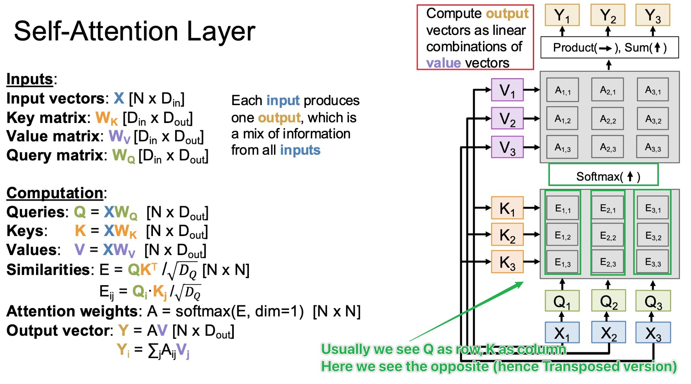
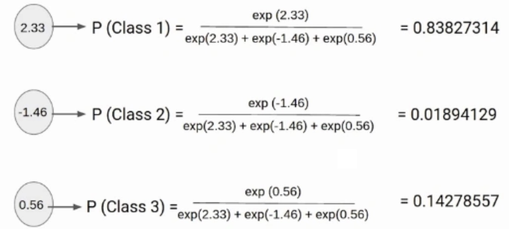
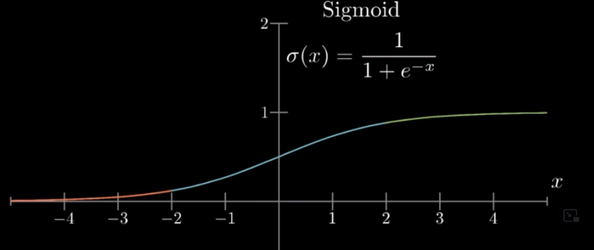
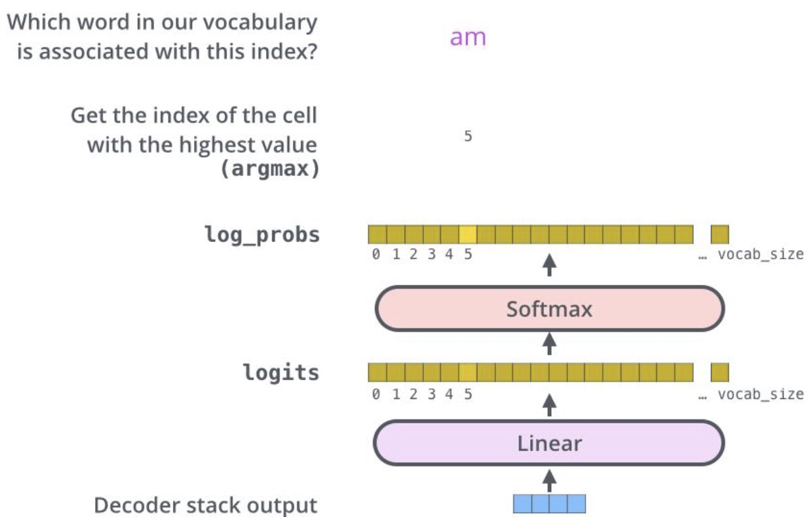
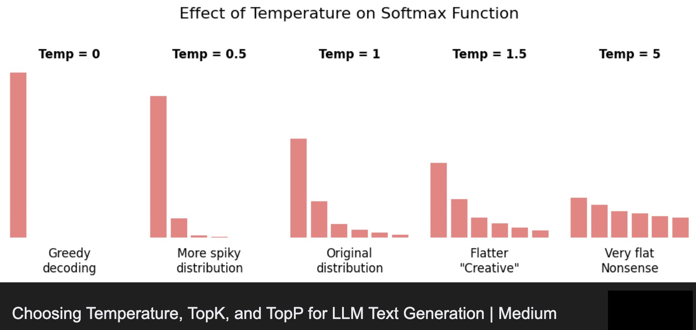

# Softmax as Multi-Dimensional Sigmoid

---

## 1. From Scores to Decisions

In attention, we compute scores:

$$
s_i = q \cdot k_i
$$

These scores are unbounded and not normalized.

We need to convert them into weights:

$$
\alpha_i \ge 0, \quad \sum_i \alpha_i = 1
$$

This is the role of **softmax**.

---

## 2. The Softmax Function

Given a vector of scores $s$:

$$
\boxed{\alpha_i = \frac{\exp(s_i)}{\sum_j \exp(s_j)}}
$$

This produces a probability distribution over all positions.

---

## 3. Connection to Sigmoid

For two elements $s_1, s_2$:

$$
\alpha_1 = \frac{\exp(s_1)}{\exp(s_1) + \exp(s_2)}
$$

Rewriting:

$$
\alpha_1 = \frac{1}{1 + \exp(-(s_1 - s_2))}
$$

This is exactly a **sigmoid** applied to $(s_1 - s_2)$.

---

## 4. Generalization

Softmax extends sigmoid from 2 choices to $n$ choices.

* Sigmoid: binary selection
* Softmax: multi-way selection

Both map real values to probabilities.

---

## 5. Competition Between Elements

Softmax introduces **competition**:

* Increasing one $s_i$ decreases others' probabilities
* The distribution depends on **relative differences**, not absolute values

This is crucial for attention:

> Tokens compete for relevance

---

## 6. Effect of Scale

If scores are large:

* Softmax becomes sharp (close to one-hot)
* Only one position dominates

If scores are small:

* Softmax becomes smooth
* Many positions contribute

This connects to the need for scaling:

$$
\frac{Q K^T}{\sqrt{d_k}}
$$

---

## 7. Gradient Properties

Softmax is:

* Smooth and differentiable
* Sensitive to differences between scores

This allows the model to:

* Learn fine-grained attention patterns
* Adjust weights through gradient descent

---

## 8. Row-Wise Application in Attention

In matrix form:

$$
A = \text{softmax}(S)
$$

Softmax is applied **row-wise** (*in the Featured Image in this lecture, it's column wise but the idea is the same*):

$$
\sum_j A_{ij} = 1
$$

Each query produces its own distribution over all keys.

Note:

Normally we would write:

$$
\begin{array}{c|ccccc}
:& 0 & 1 & 2 & \dots & n-1 \\
\hline
0 & \alpha_{00} & \alpha_{01} & \alpha_{02} & \dots & \alpha_{0,n-1} \\
1 & \alpha_{10} & \alpha_{11} & \alpha_{12} & \dots & \alpha_{1,n-1} \\
\vdots & \vdots & \vdots & \vdots & \ddots & \vdots \\
n-1 & \alpha_{n-1,0} & \alpha_{n-1,1} & \alpha_{n-1,2} & \dots & \alpha_{n-1,n-1}
\end{array}
$$

See [lecture-7-matrix-form-of-attention.md](./lecture-7-matrix-form-of-attention.md). 

---

## 9. Softmax: From Attention Weights to Word Probabilities

**Softmax is also used in the final layer of the model to produce words.**

After the decoder produces a hidden vector $h$, we compute:

$$
o = W h + b
$$

These $o_i$ are **scores over the vocabulary** (logits), just like attention scores $e_i$.

Applying softmax:

$$
P(w_i \mid \text{context}) = \frac{\exp(o_i)}{\sum_j \exp(o_j)}
$$

