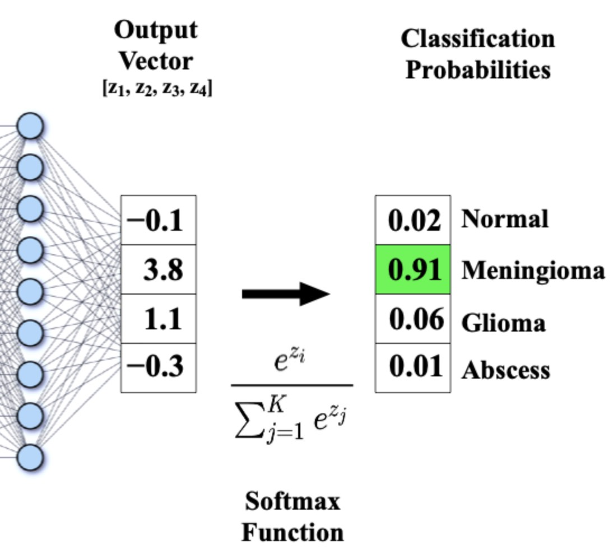

# Log-Sum-Exp Trick in Softmax

---

## 1. The Numerical Problem

Softmax is defined as:

$$
\alpha_i = \frac{\exp(e_i)}{\sum_j \exp(e_j)}
$$

However, in practice, the values $e_i$ can be large, especially when computed from:

$$
e_i = \frac{q \cdot k_i}{\sqrt{d_k}}
$$

This leads to two issues:

* $\exp(e_i)$ can overflow
* numerical instability in both numerator and denominator

---

## 2. Key Observation

Softmax is invariant to adding the same constant to the scores:

$$
\frac{\exp(e_i)}{\sum_j \exp(e_j)} =
\frac{\exp(e_i + c)}{\sum_j \exp(e_j + c)}
$$

for any constant $c$.

---

## 3. Choosing a Stable Constant

We choose:

$$
c = -\max_j e_j
$$

Then define:

$$
\tilde{e}_i = e_i - \max_j e_j
$$

---

## 4. Stable Softmax

Now compute:

$$
\alpha_i = \frac{\exp(\tilde{e}_i)}{\sum_j \exp(\tilde{e}_j)}
$$

This guarantees:

* largest exponent is 0
* all other values are negative or zero
* no overflow occurs

---

## 5. Connection to Log-Sum-Exp

The denominator:

$$
\sum_j \exp(e_j)
$$

is often written in log form:

$$
\log \sum_j \exp(e_j)
$$

This is the **log-sum-exp function**:

$$
\text{LSE}(e) = \log \sum_j \exp(e_j)
$$

It is numerically stabilized using the same trick:

$$
\text{LSE}(e) = \max_j e_j + \log \sum_j \exp(e_j - \max_j e_j)
$$

---

## 6. Why This Matters in Attention

In self-attention:

$$
\boxed{\text{Attention}(X) = \text{softmax}\left(\frac{Q K^T}{\sqrt{d_k}}\right) V}
$$

or, more generally:

$$
\boxed{\text{Attention}(Q, K, V)=
\text{softmax}\left(\frac{Q K^T}{\sqrt{d_k}}\right) V}
$$

we are computing many exponentials over large matrices.

Without stabilization:

* training becomes unstable
* gradients explode or vanish
* models fail to converge
