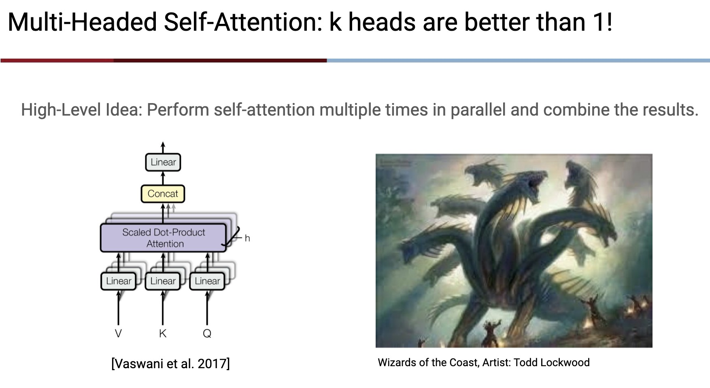
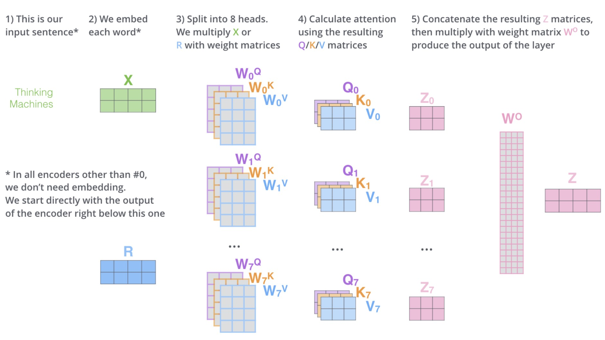
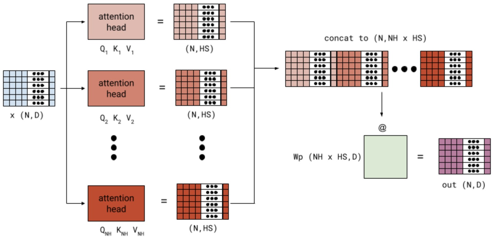

# Multi-Head Attention

---

## 1. The Limitation of Single-Head Attention

So far, attention has been defined as:

$$
\boxed{\text{Attention}(Q, K, V)=
\text{softmax}\left(\frac{Q K^T}{\sqrt{d_k}}\right) V}
$$

or, if we restrict us to self attention:

$$
\boxed{\text{Attention}(X)=
\text{softmax}\left(\frac{Q K^T}{\sqrt{d_k}}\right) V}
$$

This gives us a powerful mechanism:

> Each token can dynamically retrieve information from all other tokens.

But there is a hidden constraint:

> All relationships must be modeled inside a single similarity space.

---

### A structural problem

A single attention head must simultaneously learn:

* syntax (structure)
* semantics (meaning)
* long-range dependencies
* coreference relations

This creates a bottleneck:

> one space → one geometry → one type of reasoning

---

## 2. The Core Idea: Multiple Attention Spaces

Multi-head attention removes this constraint.

Instead of one attention mechanism, we use multiple in parallel:

> Each head learns its own attention space.

So the model does not ask:

> “What is the best attention pattern?”

It asks:

> “What are multiple valid attention patterns?”

---

## 3. Mathematical Formulation

Multi-head attention is defined as:

$$
\text{MultiHead}(Q, K, V)=
\text{Concat}\left(\text{head}^{(1)}, \dots, \text{head}^{(h)}\right) W_O
$$

Each head is computed independently:

$$
\text{head}^{(i)}=
\text{Attention}\left(X W_Q^{(i)}, X W_K^{(i)}, X W_V^{(i)}\right)
$$

---

## 4. What Changes Conceptually?

Instead of a single projection:

$$
X \rightarrow Q, K, V
$$

We now have:

$$
X \rightarrow {(Q^{(1)}, K^{(1)}, V^{(1)}), \dots, (Q^{(h)}, K^{(h)}, V^{(h)})}
$$

Each head learns:

* a different projection of the same input
* a different similarity geometry
* a different notion of relevance

---

## 5. Independence of Heads

Each head performs:

$$
\text{softmax}\left(\frac{Q^{(i)} (K^{(i)})^T}{\sqrt{d_k}}\right) V^{(i)}
$$

Crucially:

> Heads do not interact during computation.

So we have:

* parallel attention systems
* independent representation subspaces
* no communication between heads yet

---

## 6. Concatenation: Stacking, Not Fusion

After computing all heads:

$$
H = \text{Concat}(\text{head}^{(1)}, \dots, \text{head}^{(h)})
$$

This produces:

$$
H \in \mathbb{R}^{n \times (h \cdot d_v)}
$$

Important observation:

> Concatenation is not interaction. It is only aggregation.

Each head remains structurally independent.

---

## 7. The Role of $W_O$

Final projection:

$$
\text{Output} = H W_O
$$

This is where interaction begins.

Each output dimension becomes:

$$
\text{Output}[j] =
\sum_{i,k} \text{head}^{(i)}[k] \cdot W_O[i \cdot d_v + k, j]
$$

So $W_O$ acts as:

> a learned fusion operator across heads

It enables:

* mixing syntax and semantics
* combining different attention geometries
* learning cross-head interactions

---

## 8. Dimension Structure

Multi-head attention preserves model width:

| Stage         | Shape              |
| ------------- | ------------------ |
| Input         | $(n, d_{\text{model}})$   |
| Per head      | $(n, d_v)$         |
| Concatenation | $(n, h \cdot d_v)$ |
| Output        | $(n, d_{\text{model}})$   |

With:

$$
h \cdot d_v = d_{\text{model}}
$$

So multi-head attention is:

> a structured decomposition of the same representation space

---

## 9. Matrix Dimensions: The Computational Flow

**Step 1: Linear Projections (Creating Q, K, V)**
The input $X$ is projected into three different spaces. Note how $d_{\text{model}}$ is transformed into the head dimension.

$$
Q = \underbrace{X}_{(n, d_{\text{model}})} \cdot \underbrace{W_Q}_{(d_{\text{model}}, d_k)} \rightarrow (n, d_k)
$$

$$
K = \underbrace{X}_{(n, d_{\text{model}})} \cdot \underbrace{W_K}_{(d_{\text{model}}, d_k)} \rightarrow (n, d_k)
$$

$$
V = \underbrace{X}_{(n, d_{\text{model}})} \cdot \underbrace{W_V}_{(d_{\text{model}}, d_v)} \rightarrow (n, d_v)
$$

**Step 2: Scored Dot-Product (Interaction)**
The $Q$ and $K$ matrices interact to produce the attention scores. This is where every token "looks" at every other token.

$$
\text{Scores} = \underbrace{Q}_{(n, d_k)} \cdot \underbrace{K^T}_{(d_k, n)} \rightarrow (n, n)
$$

**Step 3: Scaling and Softmax (Normalization)**
We stabilize the variance and convert scores into probabilities (weights). The dimensions remain unchanged.

$$
\text{Attention Weights} = \text{softmax} \left( \frac{\text{Scores}}{\sqrt{d_k}} \right) \rightarrow (n, n)
$$

**Step 4: Weighted Sum (Aggregation)**
The attention weights (the "how much to focus") are applied to the values $V$.

$$
\text{Output} = \underbrace{\text{Attention Weights}}_{(n, n)} \cdot \underbrace{V}_{(n, d_v)} \rightarrow (n, d_v)
$$

**Step 5: Multi-Head Re-projection**
In a Multi-Head setting, we concatenate $h$ heads and project back to the model dimension.

$$
\text{MultiHead}(Q,K,V) = \underbrace{\text{Concat}(\text{head}^{(1)}, ..., \text{head}^{(h)})}_{(n, h \cdot d_v)} \cdot \underbrace{W_O}_{(h \cdot d_v, d_{\text{model}})} \rightarrow (n, d_{\text{model}})
$$
