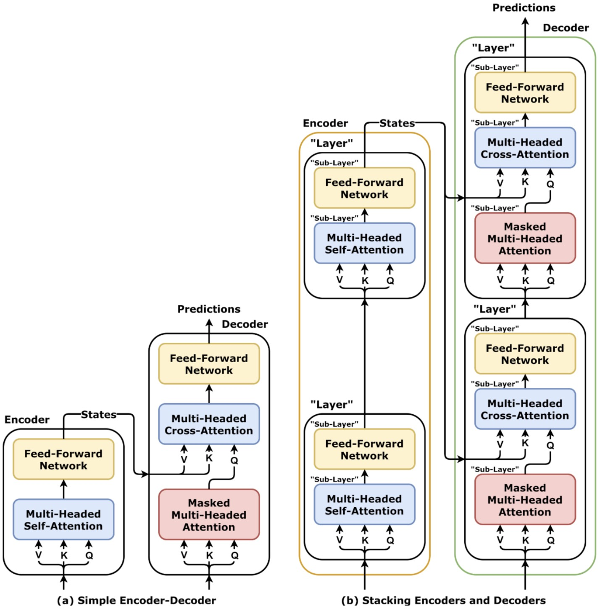
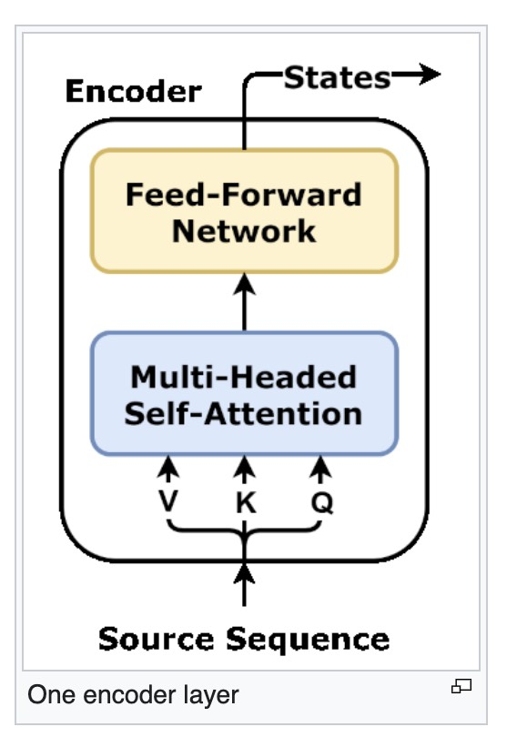
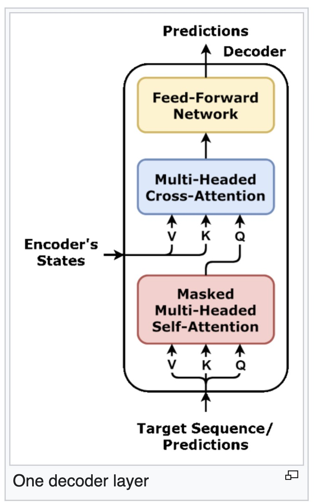
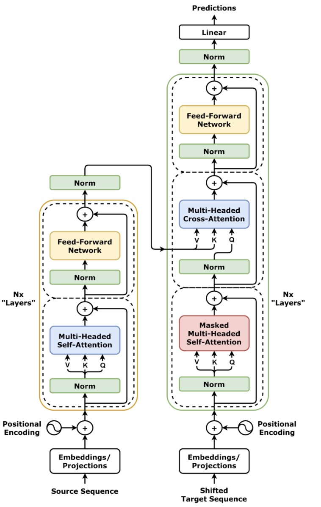

# Encoder-Decoder Architecture

---

## 1. The Core Problem

We want to model a mapping between two sequences:

$$
X = (x_1, x_2, \dots, x_n) \rightarrow Y = (y_1, y_2, \dots, y_m)
$$

But this is not a simple input-output mapping.

There are three difficulties:

* input and output lengths are different
* alignment is not given
* correspondence must be learned

So we need a structure that can:

> first understand, then generate

---

## 2. The Key Decomposition

The solution is to split the model into two systems:

### Encoder

> reads and compresses the input sequence

### Decoder

> generates the output sequence step by step

So the full model becomes:

$$
X \rightarrow \text{Encoder} \rightarrow H \rightarrow \text{Decoder} \rightarrow Y
$$

---

## 3. Encoder: Building Context

The encoder processes the entire input sequence at once.

### Input

$$
X = (x_1, x_2, \dots, x_n)
$$

Each token is mapped into a vector and passed through stacked layers.

### Output

$$
H = (h_1, h_2, \dots, h_n)
$$

Each $h_i$ is not independent.

It encodes:

* token identity
* surrounding context
* global sentence structure

So each vector becomes:

> a context-aware representation of the entire sequence

---

### Key property

The encoder is **bidirectional**:

Each token can attend to all other tokens.

So $H$ is:

> a globally consistent representation of the input sequence

---

## 4. Decoder: Autoregressive Generation

The decoder generates output step by step.

At time step $t$:

$$
P(y_t \mid y_{<t}, H)
$$

So each prediction depends on:

* previously generated tokens
* encoder representation $H$

---

### Autoregressive constraint

The decoder cannot access future tokens.

So generation is:

$$
y_1 \rightarrow y_2 \rightarrow y_3 \rightarrow \dots
$$

Each step depends on all previous steps.

---

## 5. Information Flow

The full system can be summarized as:

### Step 1: Encoding

$$
X \rightarrow H
$$

### Step 2: Decoding

At each step:

$$
(y_{<t}, H) \rightarrow y_t
$$

So the decoder performs two operations:

* self-reasoning over generated tokens
* retrieval from encoder memory

---

## 6. Why This Separation Works

The architecture splits the problem into two roles:

### Encoder

> compress global meaning into a structured representation

### Decoder

> expand that representation into a sequence

So the system becomes:

> compress → store → retrieve → generate

This separation is critical.

Without it:

* generation becomes unstable
* long-range dependencies are harder to control

