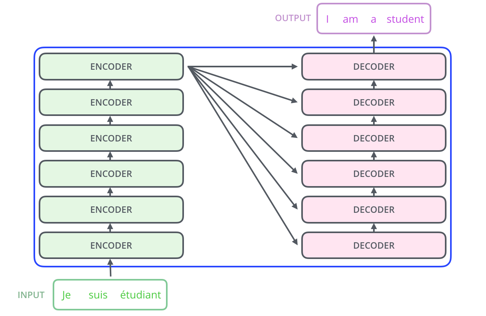

# Cross-Attention

---

## 1. From Self-Attention to Cross-Attention

In self-attention:

$$
Q, K, V \;\; \text{come from the same sequence}
$$

So every token:

* attends to itself
* attends to other tokens in the same sequence

This works when the model is:

* encoding a sentence
* building internal representations
* reasoning within one sequence

But in encoder-decoder systems, something fundamentally changes:

> we must connect two different sequences

---

## 2. The Core Question

In sequence-to-sequence models:

* Encoder produces a memory $H_{\text{enc}}$
* Decoder generates output step by step

So the question becomes:

> how does the decoder retrieve information from the encoder?

This is where cross-attention enters.

---

## 3. The Key Idea

Cross-attention separates the roles:

* Query comes from the decoder
* Keys and Values come from the encoder

So:

$$
Q \neq K, V
$$

More precisely:

* $Q$ → decoder state
* $K, V$ → encoder memory

---

## 4. Mathematical Formulation

Cross-attention is still dot-product attention:

$$
\boxed{\text{Attention}(Q, K, V)=
\text{softmax}\left(\frac{Q K^T}{\sqrt{d_k}}\right) V}
$$

But the source of each term changes:

$$
Q = H_{\text{dec}} W_Q
$$

$$
K = H_{\text{enc}} W_K
$$

$$
V = H_{\text{enc}} W_V
$$

---

## 5. Step-by-Step Mechanism

At decoder position $i$:

### Step 1: Query from decoder

The decoder state represents:

* what has been generated so far
* what information is needed next

$$
q_i = h_{\text{dec},i} W_Q
$$

### Step 2: Matching with encoder memory

Each encoder token becomes a key:

$$
k_j = h_{\text{enc},j} W_K
$$

Similarity is computed:

$$
s_{ij} = q_i \cdot k_j
$$

where $q_i$ is the query from decoder position $i$ and $k_j$ is the key from encoder position $j$.

### Step 3: Soft alignment

$$
\alpha_{ij} = \frac{\exp(s_{ij}/\sqrt{d_k})}{\sum_{j'=0}^{n_{\text{enc}}-1} \exp(s_{ij'}/\sqrt{d_k})}
$$

This creates:

> a soft mapping between output position and input tokens

### Step 4: Retrieval

$$
\text{context}_i = \sum_{j=0}^{n_{\text{enc}}-1} \alpha_{ij} v_j
$$

So the decoder retrieves:

> a weighted combination of encoder information

---

## 6. Why Cross-Attention Is Necessary

Without cross-attention:

* decoder has no access to input sequence
* generation becomes unguided
* translation is impossible

With cross-attention:

* decoder can repeatedly query encoder memory
* each output token is grounded in input

So the mechanism ensures:

> generation is always conditioned on source meaning

---

## 7. Three Key Properties

Cross-attention introduces three structural differences:

### 1. Asymmetric roles

* encoder → memory provider
* decoder → query generator

### 2. Directed information flow

$$
\text{Encoder} \rightarrow \text{Decoder}
$$

No reverse flow exists.

### 3. Dynamic alignment

At each step $t$:

* different queries
* different attention distributions

So alignment is:

> time-dependent and adaptive

---

## 8. Three Types of Attention Compared

| Property | Self-Attention (Encoder) | Self-Attention (Decoder) | Cross-Attention |
|:---------|:------------------------|:------------------------|:----------------|
| Q source | Encoder | Decoder | Decoder |
| K source | Encoder | Decoder | Encoder |
| V source | Encoder | Decoder | Encoder |
| Mask | Padding only | Causal + Padding | Padding only |
| Purpose | Build source representation | Generate target autoregressively | Access source information |
| Matrix shape | $(n, n)$ | $(m, m)$ | $(m, n)$ |

