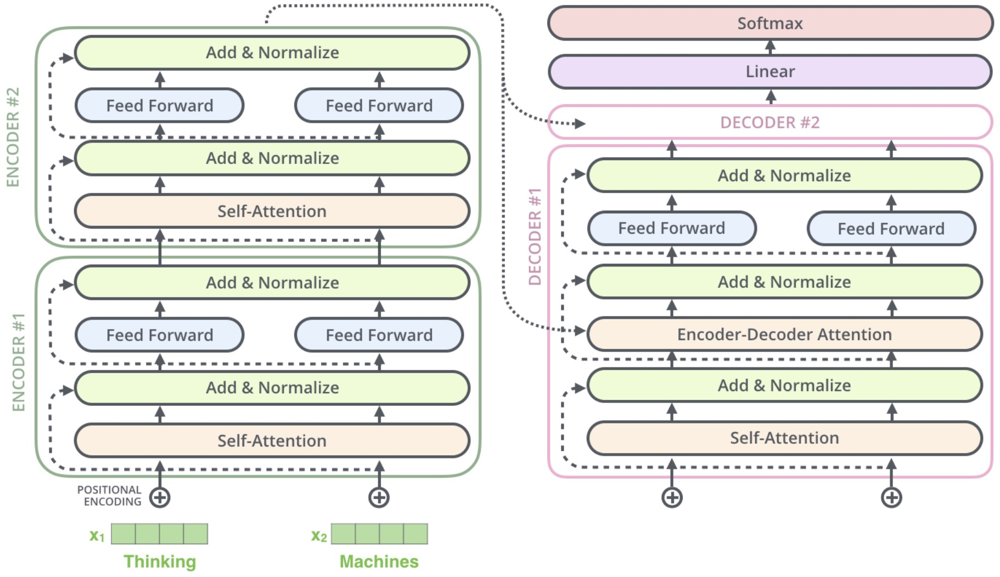
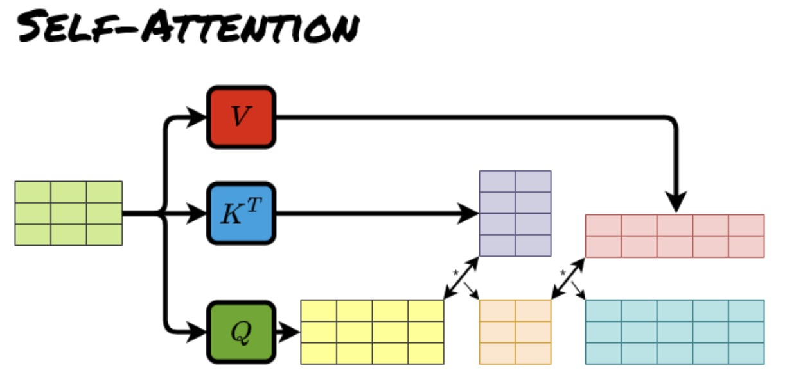
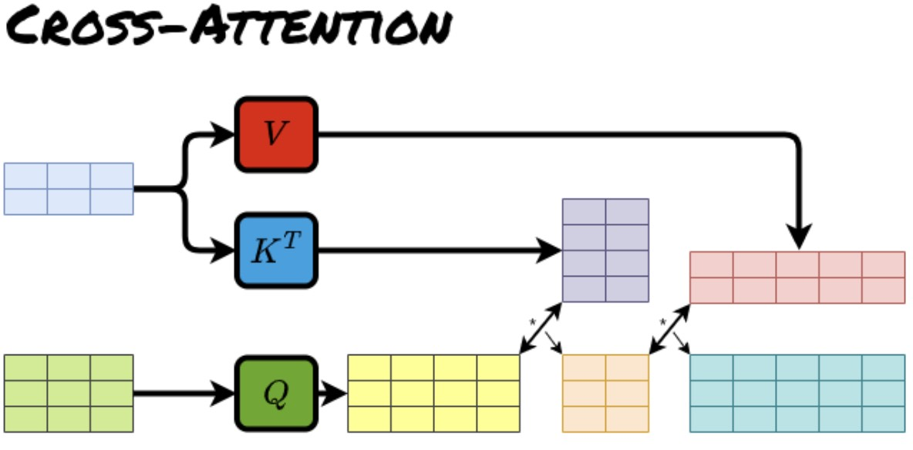

# Self-Attention vs Cross-Attention

---

## 1. The Core Distinction

At this point, we have two attention mechanisms:

* **Self-attention**: within one sequence
* **Cross-attention**: between two sequences

They share the same mathematical form:

$$
\boxed{\text{Attention}(Q, K, V)=
\text{softmax}\left(\frac{Q K^T}{\sqrt{d_k}}\right) V}
$$

But they differ completely in *where Q, K, V come from*.

---

## 2. Self-Attention: Internal Communication

In self-attention:

$$
Q, K, V \; \text{all come from the same sequence}
$$

So:

$$
Q = X W_Q, \quad K = X W_K, \quad V = X W_V
$$

### Intuition

Each token:

* looks at all other tokens
* builds a context-aware representation
* updates itself using global information

So self-attention is:

> intra-sequence reasoning

---

### Behavior

Self-attention answers:

> “What does this token mean in the context of the whole sequence?”

It builds:

* syntax structure
* semantic relationships
* long-range dependencies

---

## 3. Cross-Attention: External Retrieval

In cross-attention:

* Query comes from decoder
* Keys and Values come from encoder

So:

$$
Q = H_{\text{dec}} W_Q, \quad K = H_{\text{enc}} W_K, \quad V = H_{\text{enc}} W_V
$$

### Intuition

The decoder is asking:

> “Given what I have generated so far, what parts of the input are relevant now?”

So cross-attention is:

> inter-sequence retrieval

---

## 4. Structural Difference

We can summarize the difference structurally:

### Self-Attention

$$
\text{same sequence} \rightarrow \text{same space}
$$

### Cross-Attention

$$
\text{decoder space} \rightarrow \text{encoder space}
$$

So:

| Type            | Source of Q   | Source of K,V |
| --------------- | ------------- | ------------- |
| Self-attention  | same sequence | same sequence |
| Cross-attention | decoder       | encoder       |

---

## 5. Matrix Perspective

### Self-attention

If sequence length is $n$:

$$
\text{scores} \in \mathbb{R}^{n \times n}
$$

Each token attends to every other token.

---

### Cross-attention

If decoder length is $n_{\text{dec}}$ and encoder length is $n_{\text{enc}}$:

$$
\text{scores} \in \mathbb{R}^{n_{\text{dec}} \times n_{\text{enc}}}
$$

So:

* rows = decoder positions
* columns = encoder tokens

This creates:

> a soft alignment matrix between two sequences

---

## 6. Functional Difference

### Self-attention

Purpose:

> build internal representation of a sequence

It answers:

* what is relevant inside this sentence?

---

### Cross-attention

Purpose:

> connect two sequences

It answers:

* what part of the input sequence is relevant for this output step?

---

## 7. Information Flow Difference

### Self-attention flow

$$
X \rightarrow \text{Attention}(X,X,X) \rightarrow X'
$$

Information stays inside the same sequence.

---

### Cross-attention flow

$$
X_{\text{enc}} \rightarrow H_{\text{enc}}
$$

$$
X_{\text{dec}} \rightarrow \text{Attention}(Q, H_{\text{enc}}, H_{\text{enc}})
$$

Information flows:

> encoder → decoder

---

## 8. Why Both Are Needed

A Transformer needs both roles:

### Encoder side

* self-attention only
* builds global representation

### Decoder side

* self-attention + cross-attention
* generates conditioned output

So:

* self-attention = reasoning
* cross-attention = grounding
