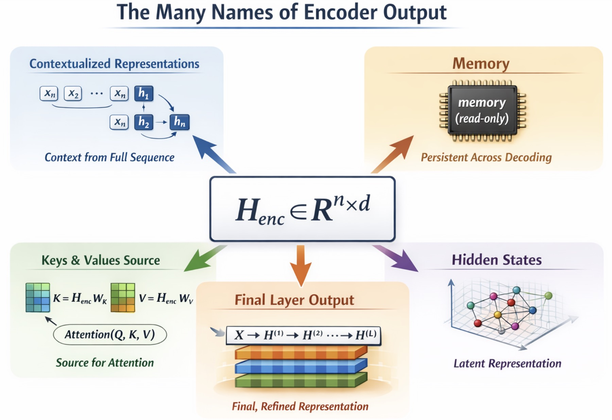

# The Many Names of Encoder Output

---

In a Transformer, the final output of the Encoder is a single tensor:

$$
\boxed{H_{\text{enc}} \in \mathbb{R}^{n \times d}}
$$

This tensor is passed to the Decoder and reused throughout generation.

Although it is one object, it is described using different names depending on how we look at it.

---

## 1. Contextualized Representations

**(Representation Perspective)**

Each input token is transformed from a static embedding into a context-dependent vector.

Given input:

$$
X = (x_1, x_2, \dots, x_n)
$$

the Encoder produces:

$$
H_{\text{enc}} = (h_1, h_2, \dots, h_n)
$$

Each $h_i$ depends on the entire sequence:

$$
h_i = f(x_1, x_2, \dots, x_n)
$$

This contrasts with static embeddings, where each word has a fixed vector.

**Meaning of the name:**

* “contextualized” emphasizes that representations are shaped by surrounding tokens
* each position encodes both local and global information

---

## 2. Memory

**(System Perspective)**

In the encoder–decoder architecture, the Encoder and Decoder play different roles:

* Encoder: produces a representation once
* Decoder: repeatedly accesses it

During decoding:

* $H_{\text{enc}}$ does not change
* it is queried at every generation step

Thus, it behaves like:

$$\text{a fixed, read-only memory}$$

This is why many implementations refer to it as:

$$\boxed{\text{memory}}$$

---

## 3. Source of Keys and Values

**(Attention Perspective)**

In cross-attention, the Decoder does not use $H_{\text{enc}}$ directly.
Instead, it is projected into Keys and Values:

$$
K = H_{\text{enc}} W_K, \quad V = H_{\text{enc}} W_V
$$

These are used in:

$$
\boxed{\text{Attention}(Q, K, V)
= \text{softmax}\left(\frac{Q K^T}{\sqrt{d_k}}\right) V}
$$

Interpretation:

* $K$ defines how encoder positions are matched
* $V$ defines what information is retrieved

**Meaning of the name:**

* the encoder output serves as the **source** from which the retrieval structure is built

---

## 4. Hidden States

**(Deep Learning Perspective)**

The tensor $H_{\text{enc}}$ is also referred to as:

$$\boxed{\text{hidden states}}$$

This reflects two properties:

* it is not directly interpretable
* it exists in a high-dimensional latent space

Each vector $h_i$ encodes:

* lexical information
* syntactic relations
* semantic structure

but not in a human-readable form.

---

## 5. Why the Final Layer Output

The Encoder consists of multiple layers:

$$
X \rightarrow H^{(1)} \rightarrow H^{(2)} \rightarrow \dots \rightarrow H^{(L)}
$$

In practice, we use:

$$
H_{\text{enc}} = H^{(L)}
$$

Reason:

* deeper layers incorporate more global context
* representations become progressively refined
* the final layer provides the most integrated view of the sequence

Earlier layers contain partial structure, but not the fully composed representation.

---

## Final View

All these names refer to the same object:

$$
H_{\text{enc}}
$$

They emphasize different aspects:

| Name                           | Emphasis                          |
| ------------------------------ | --------------------------------- |
| Contextualized representations | dependence on full sequence       |
| Memory                         | persistence across decoding       |
| Keys and Values source         | role in attention retrieval       |
| Hidden states                  | latent, high-dimensional encoding |

The object itself does not change.
Only the perspective changes.

This tensor is the bridge between:

* encoding (understanding the source)
* decoding (generating the target)
