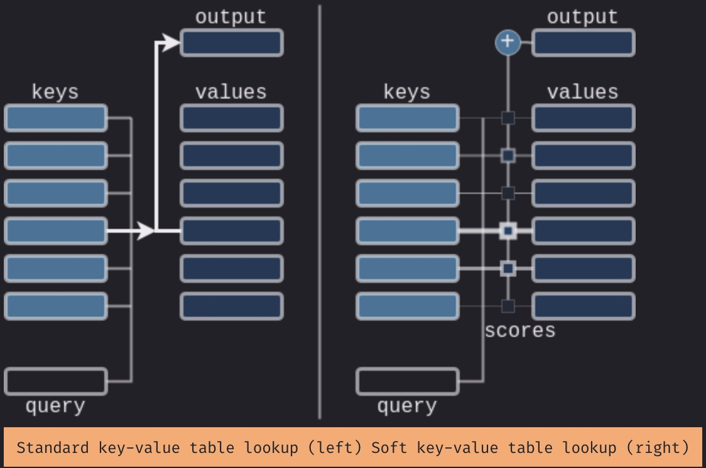
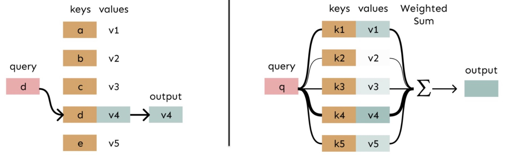

# Attention as Soft Lookup

---

## 1. From Weights to Retrieval

In the previous lecture, we moved from static weights to dynamic weights:

$$
y = \sum_i \alpha_i(x) \cdot x_i
$$

Now we ask a more concrete question:

> How should we interpret $\alpha_i(x)$?

A useful perspective is:

> Attention is a form of **information retrieval**

---

## 2. Hard Lookup vs Soft Lookup

### Hard Lookup

In a traditional lookup system:

* One query → one exact match
* One key → one value

This is rigid:

* No ambiguity
* No partial matches

### Soft Lookup

Attention relaxes this idea.

Instead of selecting one item, we combine all items:

* Every key contributes
* Contribution depends on relevance

This produces a **weighted retrieval** rather than a single match.

---

## 3. The Intuition

Consider a query:

> "What does the word *it* refer to?"

In a sentence, multiple words are candidates:

* some are more relevant
* some are less relevant

Instead of choosing one, the model assigns degrees of importance.

This is the core idea:

> Retrieve information by blending all candidates, weighted by relevance.

---

## 4. Attention as a Three-Step Process

The Attention mechanism can be understood in three steps.

### Step 1: Query

You start with a **question** or a **need**.

In language:

> I need to understand what a token refers to in context.

This produces a **query representation**.

### Step 2: Matching

The query is compared with all available **keys** in the sequence.

Each comparison produces a **relevance score**:

* higher score → more relevant
* lower score → less relevant

This step answers:

> How related is each element to the query?

### Step 3: Retrieval

Finally, the system collects information from all **values**.

But instead of selecting one, it computes a weighted sum:

> more relevant items contribute more
> less relevant items contribute less

---

## 5. Mathematical Form

The full computation is:

$$
\boxed{\text{Output} = \sum_i \alpha_i \cdot v_i}
$$

Where:

* $v_i$ is the value at position $i$
* $\alpha_i$ is the attention weight for position $i$
* $\alpha_i$ reflects relevance to the query

The weights satisfy:

$$
\sum_i \alpha_i = 1
$$

So they form a probability distribution over all positions.
