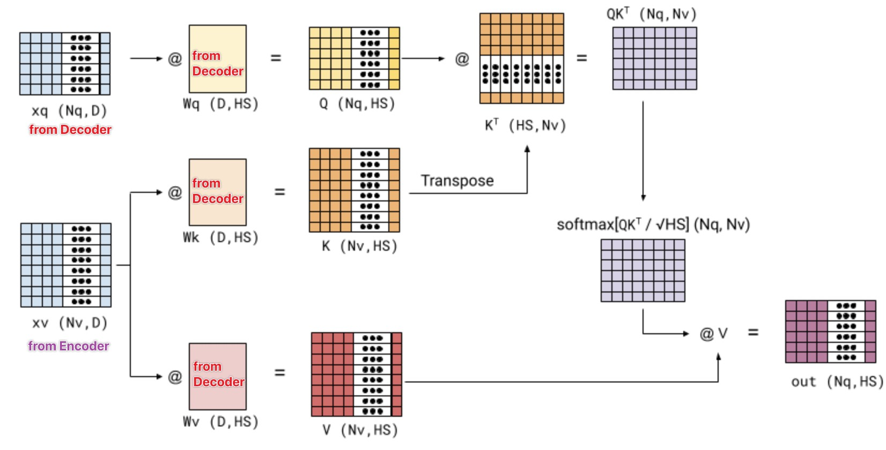

# Cross-Attention Parameter Structure

---

## 1. The Core Structure

Cross-attention combines **two different sources of representations**:

* Decoder state:
  $$
  H_{\text{dec}}^{(l)} \in \mathbb{R}^{n_{\text{dec}} \times d_{model}}
  $$

* Encoder output (memory):
  $$
  H_{\text{enc}} \in \mathbb{R}^{n_{\text{enc}} \times d_{model}}
  $$

The attention computation is:

$$
\text{CrossAttn}(H_{\text{dec}}^{(l)}, H_{\text{enc}}) =
\text{softmax}\left(
\frac{Q K^T}{\sqrt{d_k}}
\right) V
$$

with projections:

$$
Q = H_{\text{dec}}^{(l)} W_Q^{(l)}, \quad
K = H_{\text{enc}} W_K^{(l)}, \quad
V = H_{\text{enc}} W_V^{(l)}
$$

---

## 2. A Critical Distinction: Data vs Parameters

There is a subtle but essential separation:

* **Data source**

  * $Q$ comes from the decoder
  * $K, V$ come from the encoder

* **Parameter location**

  * $W_Q^{(l)}, W_K^{(l)}, W_V^{(l)}$ all belong to the **decoder layer**

So even though:

$$
K, V \leftarrow H_{\text{enc}}
$$

the transformations are still controlled by:

$$
W_K^{(l)}, W_V^{(l)} \quad \text{(decoder parameters)}
$$

---

## 3. Interpretation: Decoder Controls the View

This design means:

> The encoder provides **information**, but the decoder decides **how to read it**

Each decoder layer defines its own projections:

$$
H_{\text{enc}} \xrightarrow{W_K^{(l)}, W_V^{(l)}} \text{layer-specific representation}
$$

So:

* The encoder memory is **shared**
* The interpretation of that memory is **layer-dependent**

---

## 4. No Parameter Sharing

The projection matrices are **independent across three axes**:

### 4.1 Across Layers

For different decoder layers:

$$
W_Q^{(1)} \neq W_Q^{(2)} \neq \cdots \neq W_Q^{(L)}
$$

Each layer learns a different way to query the same memory.

### 4.2 Across Attention Types

Within the decoder, we have:

* masked self-attention
* cross-attention

They use different parameter sets:

$$
W_Q^{\text{self}} \neq W_Q^{\text{cross}}
$$

because they solve different problems:

* self-attention → sequence modeling
* cross-attention → memory retrieval

### 4.3 Across Heads

In multi-head attention:

$$
W_Q^{(i)}, \; W_K^{(i)}, \; W_V^{(i)} \quad (i = 1, \dots, h)
$$

Each head operates in its own subspace.

---

## 5. Why This Independence Matters

### 5.1 Different Roles

* Encoder: builds representations
* Decoder: consumes and interprets them

Sharing parameters would remove this asymmetry.

### 5.2 Different Distributions

$$
H_{\text{enc}} \neq H_{\text{dec}}
$$

They encode different structures, so projections must adapt accordingly.

### 5.3 Layerwise Refinement

Each layer performs a different type of retrieval:

* early layers → alignment, position
* deeper layers → semantics

This requires distinct projections per layer.

---

## 6. Final Form

Putting everything together:

$$
\boxed{
\text{CrossAttn}^{(l)} =
\text{softmax}
\left(
\frac{
(H_{\text{dec}}^{(l)} W_Q^{(l)})
(H_{\text{enc}} W_K^{(l)})^T
}{\sqrt{d_k}}
\right)
(H_{\text{enc}} W_V^{(l)})}
$$

---

## 7. Key Takeaway

Cross-attention is defined by a clear separation:

> **Encoder = memory provider**
> **Decoder = memory reader (with its own parameters)**

and:

> The same memory is reused, but never interpreted in the same way twice.

