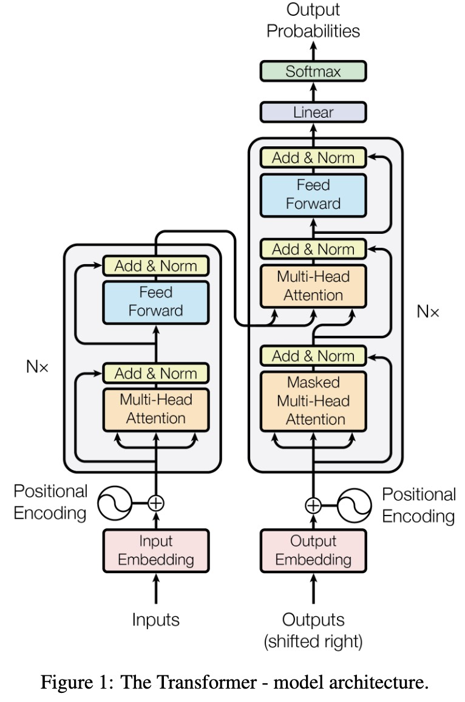

# Transformer Block Assembly



---

## 1. From Mechanism to Module

We have already seen:

* dot-product similarity
* softmax normalization
* Q, K, V factorization
* multi-head decomposition
* encoder–decoder interaction

Now we stop treating them separately and ask:

> What is the minimal reusable unit that contains all of them?

That unit is the **Transformer block**.

Conceptual code:

```python
class TransformerBlock(nn.Module):
    def __init__(self, d_model, d_ff, n_heads):
        super().__init__()
        self.attention = nn.MultiheadAttention(d_model, n_heads)
        self.ffn = nn.Sequential(
            nn.Linear(d_model, d_ff),
            nn.ReLU(),
            nn.Linear(d_ff, d_model)
        )
        self.norm1 = nn.LayerNorm(d_model)
        self.norm2 = nn.LayerNorm(d_model)
    
    def forward(self, x):
        # Attention: Get context
        attn_out, _ = self.attention(self.norm1(x), x, x)
        x = x + attn_out
        
        # FFN: Process
        ffn_out = self.ffn(self.norm2(x))
        x = x + ffn_out
        
        return x
```


---

## 2. A Fixed-Shape Update Operator

A block maps:

$$
X \in \mathbb{R}^{n \times d_{\text{model}}} \rightarrow \mathbb{R}^{n \times d_{\text{model}}}
$$

The shape is preserved:

* same sequence length
* same feature dimension
* only representations change

So:

$$
X^{l+1} = \text{Block}(X^l)
$$

A block is best viewed as a **state update over a sequence**.

---

## 3. Two Core Subsystems

### 3.1 Attention: Global Interaction


$$
\boxed{\text{Attention}(X) = \text{softmax}\left(\frac{Q K^T}{\sqrt{d_k}}\right) V}
$$


or, more generally:

$$
\boxed{\text{Attention}(Q, K, V)=
\text{softmax}\left(\frac{Q K^T}{\sqrt{d_k}}\right) V}
$$

with:

$$
Q = X W_Q,\quad K = X W_K,\quad V = X W_V
$$

Role:

* tokens interact globally
* dependencies are data-dependent
* information flows across positions

---

### 3.2 FFN: Local Transformation

$$
\text{FFN}(x_i) = W_2 \sigma(W_1 x_i)
$$

Applied independently:

$$
X \rightarrow \text{FFN}(X)
$$

Role:

* no token interaction
* nonlinear feature transformation

---

## 4. Residual Structure

Each sublayer is wrapped as:

$$
X \rightarrow X + \mathcal{F}(X)
$$

So the block becomes:

$$
X^{l+1} = X^l + \Delta_{\text{attn}} + \Delta_{\text{ffn}}
$$

This enables stable deep stacking.

---

## 5. Normalization

Layer normalization stabilizes the representation space:

* controls scale
* prevents drift across layers

---

## 6. The Two-Stage Pattern

A Transformer block always follows:

### Stage 1: Communication

Attention mixes information across tokens

### Stage 2: Computation

FFN transforms each token independently

So:

> first gather information, then process it

---

## 7. Multi-Head Inside Attention

Attention itself is decomposed:

$$
\text{head}^{(i)} =
\text{softmax}\left(\frac{Q^{(i)} K^{(i)T}}{\sqrt{d_k}}\right) V^{(i)}
$$

Then:

$$
\text{MHA}(X) =
\text{Concat}(\text{head}^{(1)}, \dots, \text{head}^{(h)}) W_O
$$

So interaction is split into **parallel relational subspaces**.

---

## 8. Encoder vs Decoder Blocks

The core block is the same.

The difference is wiring:

* encoder: self-attention
* decoder: self-attention + cross-attention

Cross-attention simply changes:

* queries from decoder
* keys/values from encoder

---

## 9. Final View

A Transformer block implements:

$$
\text{State}^{l+1}
= \text{State}^l + \text{Interaction}(\text{State}^l) + \text{Transformation}(\text{State}^l)
$$

Where:

* interaction = attention
* transformation = FFN

---

## 10. Key Insight

A Transformer block is:

> a structured update rule that alternates between global communication and local computation, while preserving identity.

This is the most important primitive needed.

Everything else in Transformers comes from:

* stacking this block
* connecting blocks differently
* or modifying inputs to the block
