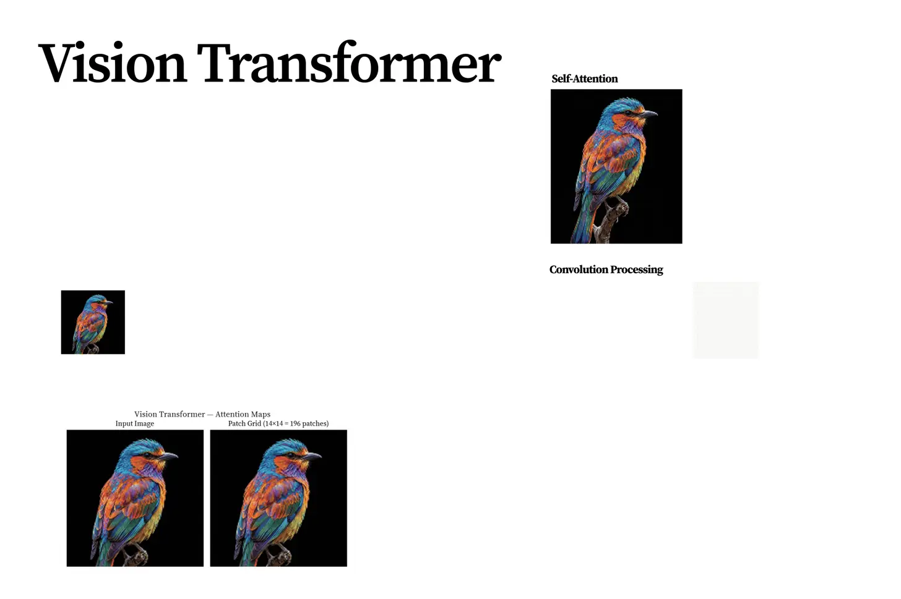
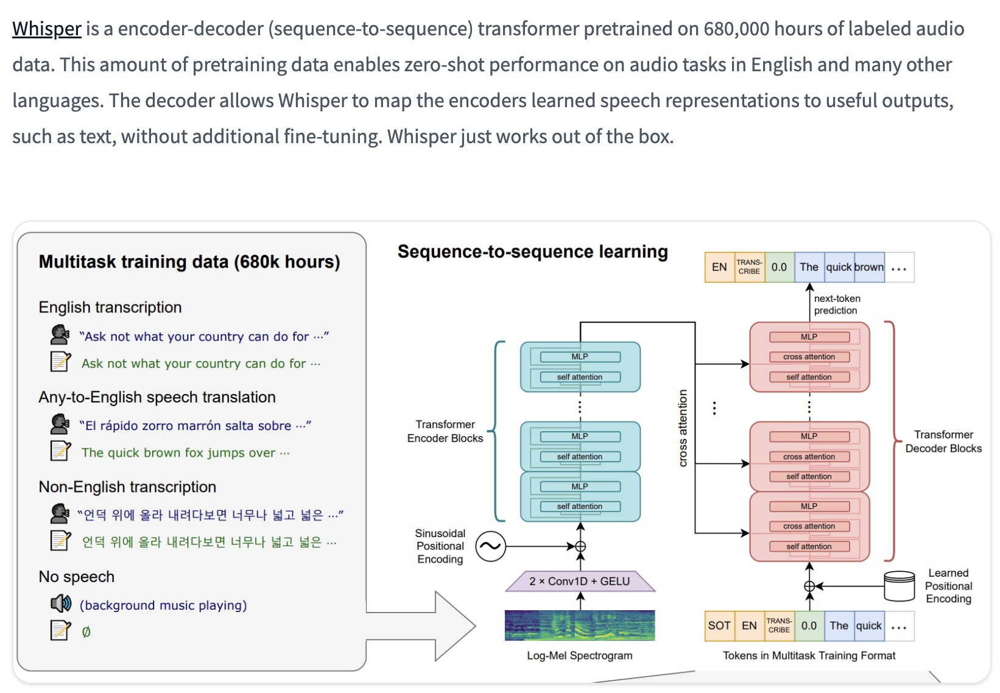

# From Block to Universe: A Modular Perspective

---

## 1. A Single Primitive

The entire Transformer reduces to one operator:

$$
X^{l+1} = \text{Block}(X^l)
$$

Everything emerges by **repeating and connecting** this block.

---

## 2. The Block is Everything

Each block contains two mechanisms:

### Attention (interaction)

$$
\text{softmax}\left(\frac{QK^T}{\sqrt{d_k}}\right)V
$$

* global, dynamic communication
* decides **what interacts**

### FFN (transformation)

$$
\text{FFN}(x_i) = W_2 \sigma(W_1 x_i)
$$

* local, per-token computation
* decides **how to transform**

Residual + normalization ensure stable stacking.

---

## 3. Everything is Composition

### Depth = stacking

$$
X^0 \rightarrow X^1 \rightarrow \cdots \rightarrow X^L
$$

* iterative refinement of representations

### Width = multi-head

* parallel attention subspaces
* different relational patterns

### Wiring = architecture

* encoder, decoder, cross-attention
* same block, different connections

---

## 4. Beyond Language

The block operates on **sequences of vectors** to:

* text (tokens)
* images (patches)
* audio (frames)
* proteins / DNA (biological sequences)

Domain knowledge is in the **representation**, not the block.

---

## 5. Role of “Extra” Components

These do not redefine the model—they support it:

* positional encoding → adds order
* masking → constrains visibility
* FFN expansion → increases capacity

They modify inputs or constraints, not the core computation.

---

## 6. Final Statement

At this point, the story of the Transformer is structurally complete.

> A single block—interaction + transformation—repeated and composed, is sufficient to model complex structures across domains.
