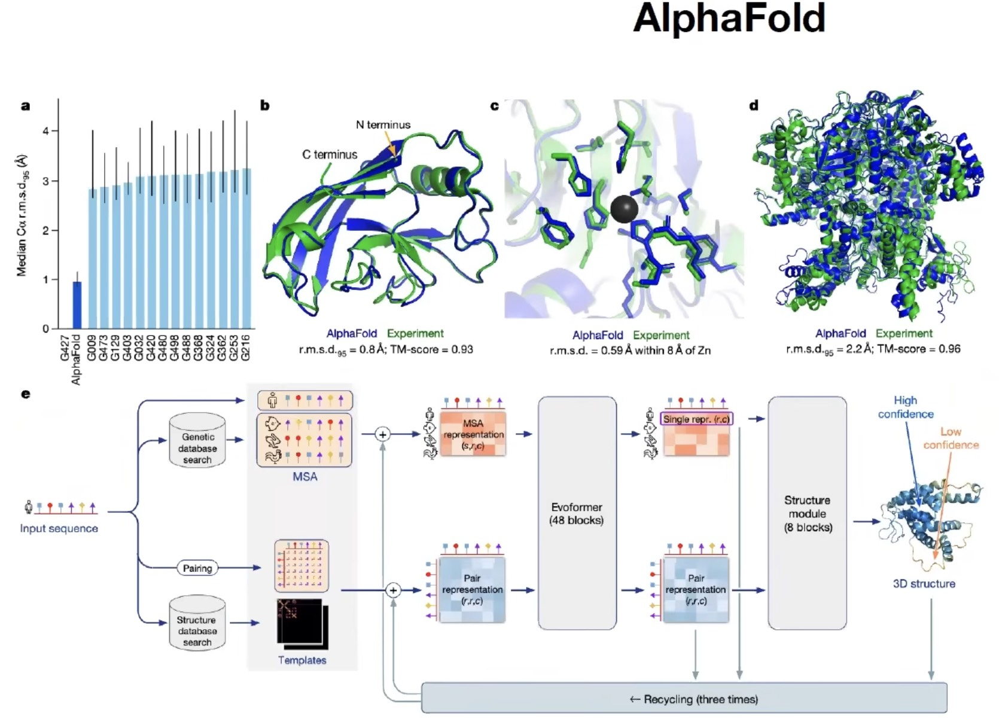
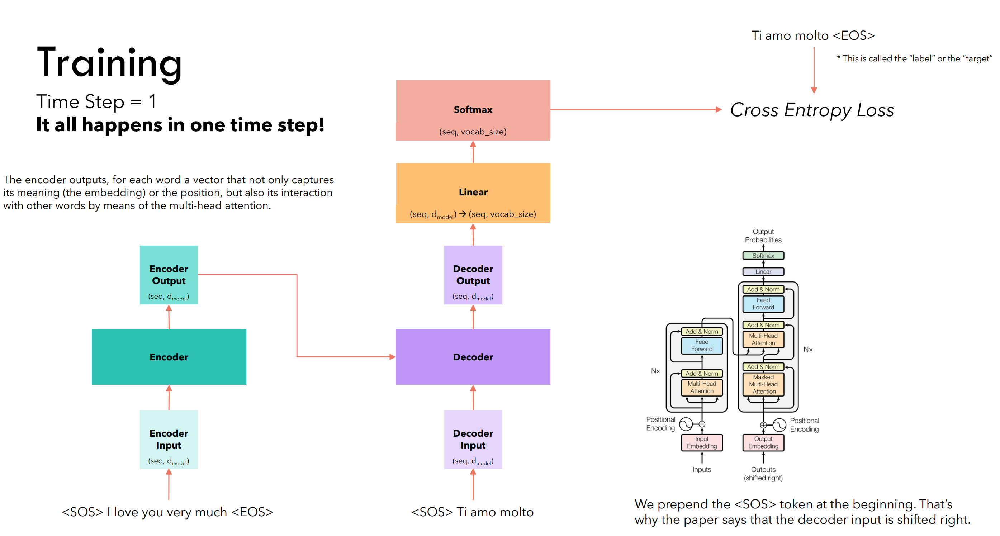

# From Architecture to Learning

---

## 1. From a Designed System to a Learned System

We have constructed the Transformer as a modular system:

* embeddings
* attention (self / cross)
* feed-forward networks
* residual connections and normalization

All composed into a single computation:

$$
H = f(X; \theta)
$$

This defines *what the model does*.

The next question is more fundamental:

**How does this entire system come to exhibit useful behavior?**

Not by designing each module individually, but by **learning all parameters jointly from data**.

---

## 2. A Unified Interface Across Modalities

One of the defining properties of modern foundation models is:

> different data types are mapped into a common matrix form

* text → tokens
* images (Vision Transformer) → patches
* audio → time-frequency segments
* protein / DNA → sequence tokens

After tokenization, all inputs become:

$$
X \in \mathbb{R}^{n \times d_{\text{model}}}
$$

This allows the same architecture to operate across domains.

The Transformer does not “know” whether it processes language, images, or biological sequences.

> it operates on matrices of tokens

---

## 3. End-to-End Mapping: Embedding to Unembedding

The full system can be viewed as:

$$
X \xrightarrow{\text{embedding}} H^{(0)} \xrightarrow{\text{Transformer layers}} H \xrightarrow{\text{unembedding}} Z
$$

where:

* embedding maps discrete or structured input into vectors
* Transformer layers perform structured computation
* unembedding maps representations to task space

$$
Z = H W_U
$$

Training is applied **end-to-end**:

> embedding and unembedding are not fixed
> they are learned together with all internal modules

---

## 4. One Objective, All Parameters

The entire system is trained under a single objective:

$$
\mathcal{L} = \mathcal{L}(Z, Y)
$$

This objective depends on the task:

* classification (vision)
* sequence prediction (language, DNA)
* regression (audio, signals)
* contrastive objectives (multimodal learning)

But structurally, all reduce to:

$$
Z \in \mathbb{R}^{n \times d_{out}}
$$

with supervision applied row-wise:

$$
\mathcal{L} = \sum_{t=0}^{n-1} \ell(Z_t, Y_t)
$$

---

### Key Principle

> **All parameters are optimized together under one loss**

This includes:

* embedding matrices
* attention projections $W_Q, W_K, W_V, W_O$
* feed-forward layers
* normalization parameters
* output projection $W_U$

There is no local training signal per module.

The model is not a collection of trained parts.

> it is a single system shaped by a global objective

---

## 5. Parallel Supervision

Because the model operates on matrices:

$$
X \in \mathbb{R}^{n \times d}
$$

it produces outputs for all positions simultaneously:

$$
Z \in \mathbb{R}^{n \times d_{out}}
$$

This leads to a fundamental property:

> **supervision happens everywhere, at once**

Each row contributes independently to the loss, but all rows are processed in parallel.

---

### Contrast with Sequential Learning

Traditional sequence models:

* compute step-by-step
* propagate information through time

Transformer-based systems:

* compute all positions simultaneously
* propagate information through attention

So training becomes:

> fully parallel optimization over the entire sequence

---

## 6. Learning Under Structural Constraints

The Transformer does not learn arbitrary functions.

Its learning is shaped by architectural constraints:

### Attention Structure

$$
\text{softmax}\left(\frac{QK^T}{\sqrt{d_k}}\right)
$$

* enforces similarity-based interaction
* defines how information is routed

---

### Parameter Sharing

$$
X W
$$

* same weights applied to all positions
* enforces consistency across tokens / patches

---

### Residual Connections

$$
H^{(l+1)} = H^{(l)} + \text{Layer}(H^{(l)})
$$

* stabilize deep optimization
* enable gradient flow across many layers

---

### Nonlinear Transformations

* feed-forward networks
* activations such as ReLU, GELU, or variants

These introduce expressive capacity beyond linear mappings.

---

## 7. Optimization as Global Coordination

Training is performed via gradient-based optimization:

$$
\theta \leftarrow \theta - \eta \frac{\partial \mathcal{L}}{\partial \theta}
$$

This involves:

* backpropagation through all layers
* optimization methods such as Adam or AdamW
* regularization (e.g., weight decay)

But the key idea is not the optimizer itself.

It is the structure of the optimization problem:

> every parameter influences many outputs
> every output influences many parameters

Training becomes a process of:

> coordinating all modules to produce coherent behavior

not tuning them independently.

---

## 8. Foundation Model Perspective

At scale, this framework enables:

* learning from massive datasets
* transfer across tasks
* emergence of general representations

Across domains:

* language models learn structure of text
* vision models learn spatial and semantic patterns
* biological models learn sequence-function relationships

Yet all follow the same pattern:

$$
X \rightarrow H \rightarrow Z \rightarrow \mathcal{L}
$$

with:

* shared architecture
* shared optimization principle

---

## 9. Final Insight

A Transformer is not trained layer by layer.

It is trained as a **single, end-to-end system**, where:

* inputs from different domains are mapped into a shared representation space
* all computations are expressed as matrix operations
* all parameters are shaped by a unified objective

or, in the language of this course:

> a foundation model is a **giant matrix program**
> learned end-to-end from data, under structural constraints
