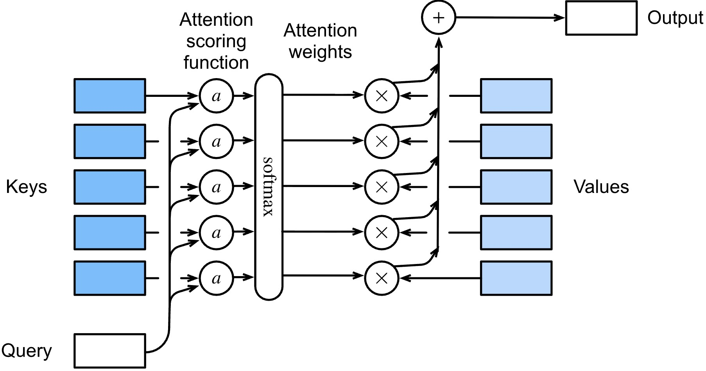

# From Soft Lookup to Computation

---

## 1. From Idea to Mechanism

Previously, we introduced attention as:

$$
\text{Output} = \sum_i \alpha_i \cdot v_i
$$

This describes a **soft lookup**: we retrieve information by taking a weighted average.

The key question now is:

> How do we compute the weights $\alpha_i$?

---

## 2. From Exact Match to Scoring

In a hard lookup system, we require exact matches:

$$
\text{match}(\text{query}, \text{key}_i) \in {0, 1}
$$

This produces one-hot selection, which is too rigid.

Instead, we define a **continuous scoring function**:

$$
s_i = \text{score}(\text{query}, \text{key}_i)
$$

Now each key receives a real-valued relevance score.

---

## 3. Vectorizing the Problem

We represent both queries and keys as vectors:

$$
q, k_i \in \mathbb{R}^{1 \times d_{\text{model}}}
$$

A simple and effective scoring function is the dot product:

$$
s_i = q \cdot k_i
$$

This measures similarity in the embedding space.

---

## 4. From Scores to Weights

The scores $s_i$ *(without scaling for now)* are unbounded and not normalized.

We convert them into a probability distribution:

$$
\alpha_i = \frac{\exp(s_i)}{\sum_j \exp(s_j)}
$$

This ensures:

$$
\alpha_i \ge 0, \quad \sum_i \alpha_i = 1
$$

---

## 5. Weighted Retrieval

Using these weights, we compute the output:

$$
\boxed{\text{Output} = \sum_i \alpha_i \cdot v_i}
$$

where $v_i$ represents the value associated with each key.

---

## 6. The Full Computation

Combining all steps:

$$
\boxed{\text{Output} = \sum_i \text{softmax}(q \cdot k_i) \cdot v_i}
$$

This is a fully differentiable mechanism that implements soft lookup.

