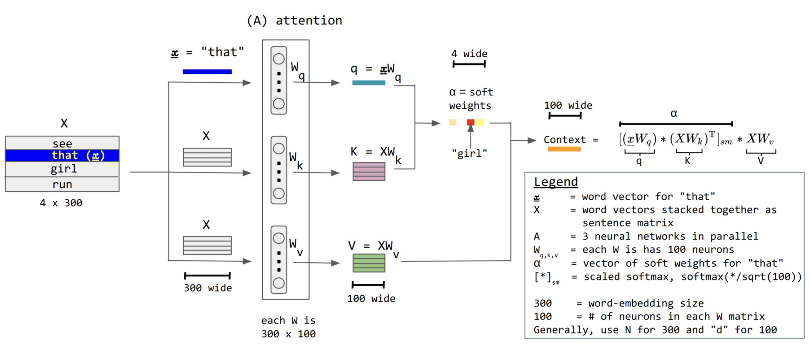
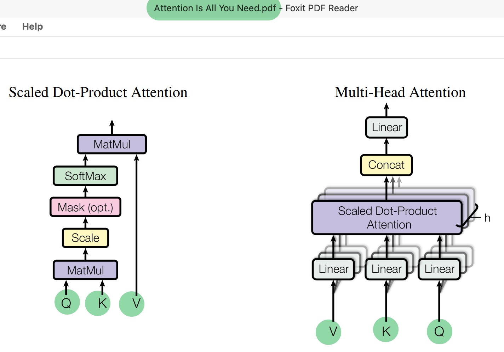

# Q, K, V: Making Soft Lookup Learnable

Figure from: 
- https://en.wikipedia.org/wiki/Attention_(machine_learning)

---

## 1. From Computation to Learnable Structure

In the previous lecture, we derived:

$$
\text{Output} = \sum_i \text{softmax}(q \cdot k_i) \cdot v_i
$$

So far, $q$, $k_i$, and $v_i$ were abstract vectors.

The next question is:

> Where do $q$, $k_i$, and $v_i$ come from?

---

## 2. Inputs Are Not Enough

We start with an input sequence:

$$
X \in \mathbb{R}^{n \times d_{model}}
$$

Each row $x_i$ is a token representation.

A naive idea would be:

$$
q = x_i, \quad k_i = x_i, \quad v_i = x_i
$$

But this is too restrictive:

* The same representation is used for **matching** and **content**
* The model cannot specialize different roles

---

## 3. Separating Roles

We introduce three different transformations:

* One for querying
* One for matching
* One for retrieving

Formally:

$$
q_i = x_i W_Q
$$

$$
k_i = x_i W_K
$$

$$
v_i = x_i W_V
$$

Where:

$$
W_Q, W_K, W_V \in \mathbb{R}^{d_{model} \times d_k}
$$

---

## 4. Matrix Form

Applying this to the full sequence:

$$
Q = X W_Q, \quad K = X W_K, \quad V = X W_V
$$

Now:

* $Q, K \in \mathbb{R}^{n \times d_k}$
* $V \in \mathbb{R}^{n \times d_v}$

Substituting into the attention computation:

$$
\text{Output} = \text{softmax}(Q K^T) V
$$

This is the standard attention form *(without scaling for now)*.
