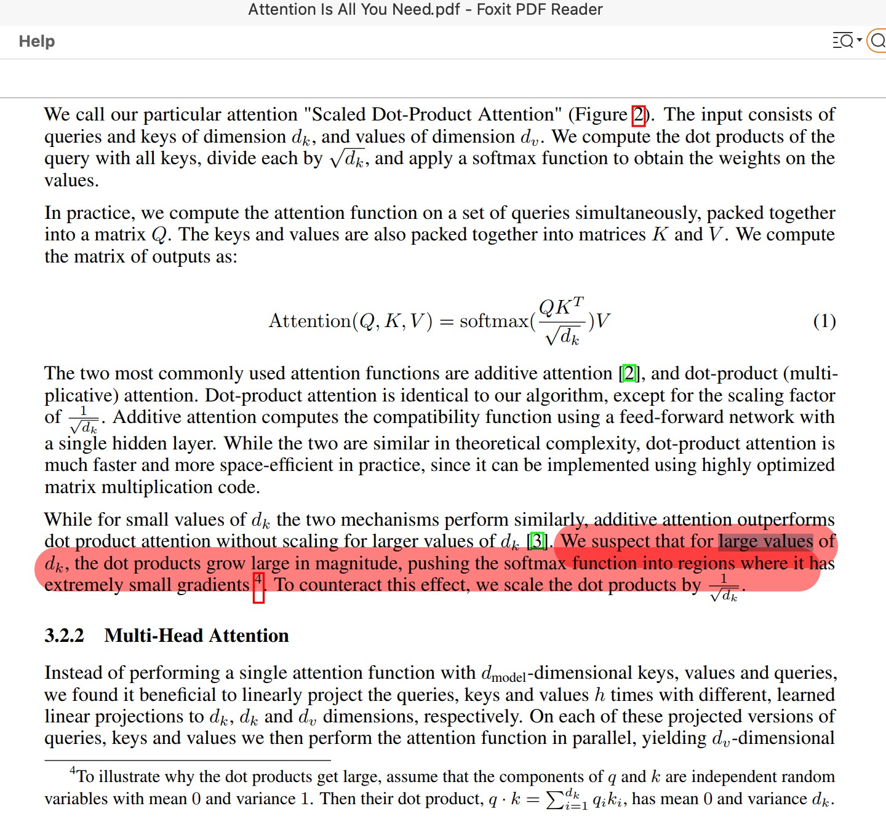
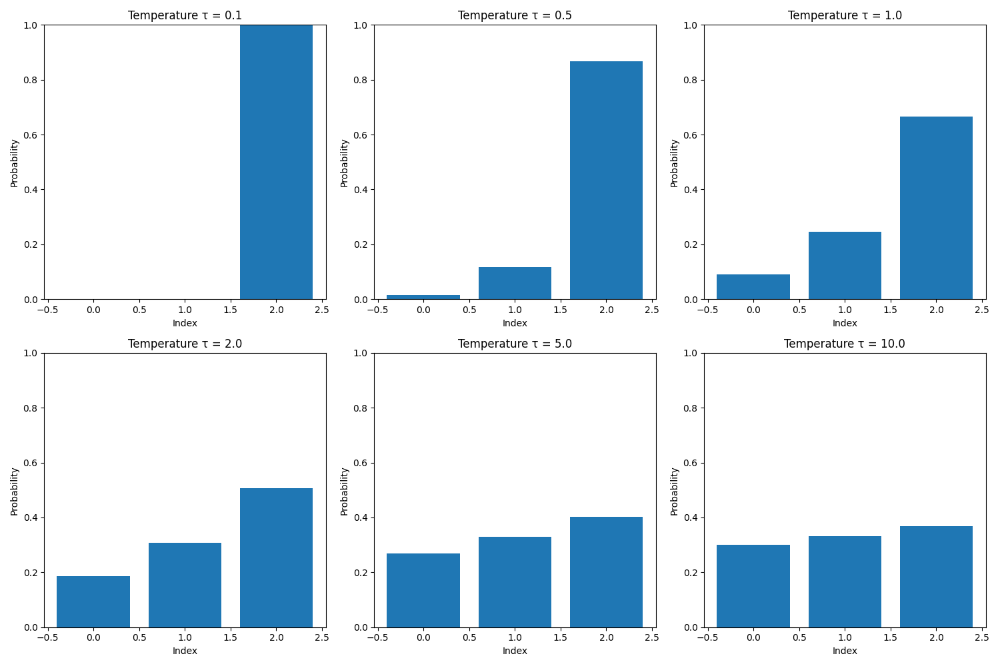
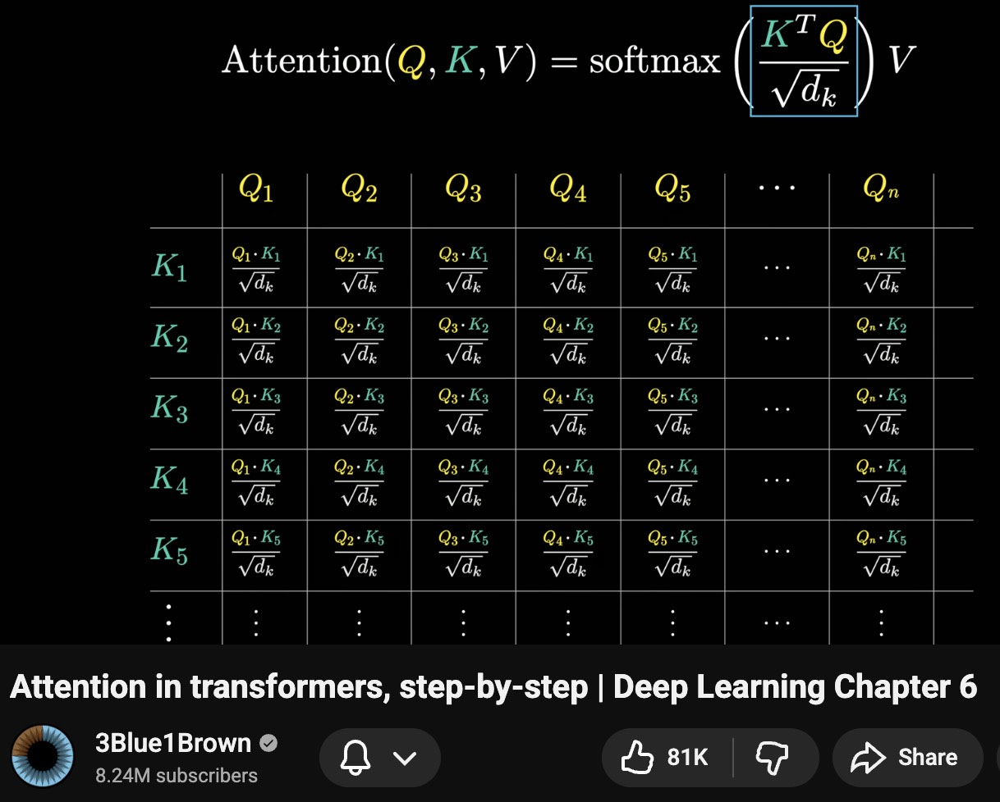
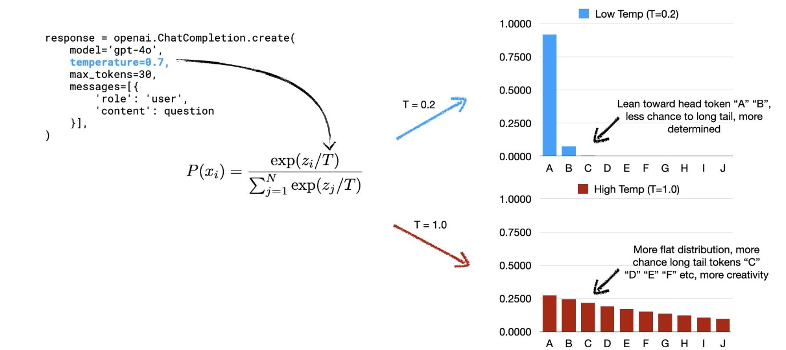

# Why Scale by $\frac{1}{\sqrt{d_k}}$

---

## 1. Where We Are

From the previous lecture, we have:

$$
Q = X W_Q, \quad K = X W_K, \quad V = X W_V
$$

and the attention computation:

$$
\text{Output} = \text{softmax}(Q K^T) V
$$

However, there is a subtle but critical issue hidden inside:

> The dot product $Q K^T$ does not behave well as dimension grows.

---

## 2. The Core Problem: Magnitude Explosion

Consider the score matrix:

$$
S = Q K^T
$$

At the element level:

$$
S_{ij} = q_i \cdot k_j = \sum_{l=1}^{d_k} q_{il} k_{jl}
$$

This is a sum over $d_k$ terms.

As $d_k$ increases:

* More terms are added
* The magnitude of $S_{ij}$ tends to grow

---

## 3. Variance Analysis

Assume a standard initialization:

$$
\mathbb{E}[q_{il}] = 0, \quad \mathbb{E}[k_{jl}] = 0
$$

$$
\text{Var}(q_{il}) = \text{Var}(k_{jl}) = 1
$$

Then:

$$
\text{Var}(q_i \cdot k_j) = d_k
$$

So:

> The scale of the dot product grows linearly with $d_k$

---

## 4. What Goes Wrong in Softmax

Attention uses:

$$
A = \text{softmax}(S)
$$

If $S$ contains large values:

* $\exp(S_{ij})$ becomes extremely large for the maximum entry
* Other entries become negligible

This leads to:

* Extremely sharp distributions
* Almost one-hot behavior

---

## 5. Why This Is Bad

A very sharp softmax causes:

* **Loss of smoothness** → no longer a “soft” selection
* **Vanishing gradients** → most positions receive near-zero gradient

In short:

> The model stops behaving like a differentiable lookup mechanism

---

## 6. The Fix: Scaling the Scores

We normalize the dot product:

$$
S = \frac{Q K^T}{\sqrt{d_k}}
$$

Element-wise:

$$
S_{ij} = \frac{q_i \cdot k_j}{\sqrt{d_k}}
$$

---

## 7. Why $\sqrt{d_k}$

From earlier:

$$
\text{Var}(q_i \cdot k_j) = d_k
$$

After scaling:

$$
\boxed{
\text{Var}\left(\frac{q_i \cdot k_j}{\sqrt{d_k}}\right) = 1
}
$$

So:

* The variance becomes **dimension-independent**
* The distribution of scores stays stable as $d_k$ changes

---

## 8. Interpretation: A Built-in Temperature

The scaling behaves like a temperature in softmax:

$$
\text{softmax}_\tau(z_i) =
\frac{\exp(z_i / \tau)}{\sum_j \exp(z_j / \tau)}
$$

Here:

$$
\tau = \sqrt{d_k}
$$

Meaning:

* Larger $d_k$ → higher temperature → softer distribution
* Prevents attention from becoming too sharp

---

## 9. Final Formulation

With scaling, attention weights between position $i$ and position $j$:

$$
\boxed{\alpha_{ij} = \text{softmax}_j\left(\frac{q_i \cdot k_j}{\sqrt{d_k}}\right) = \frac{\exp(e_{ij} / \sqrt{d_k})}{\sum_{l=1}^n \exp(e_{il} / \sqrt{d_k})}}
$$

Attention is then formulated as:

$$
\boxed{
\text{Attention}(Q, K, V)=
\text{softmax}\left(\frac{Q K^T}{\sqrt{d_k}}\right) V
}
$$

Or in terms of $X$:

$$
\boxed{
\text{Attention}(X)=
\text{softmax}\left(\frac{(X W_Q)(X W_K)^T}{\sqrt{d_k}}\right)
(X W_V)
}
$$
