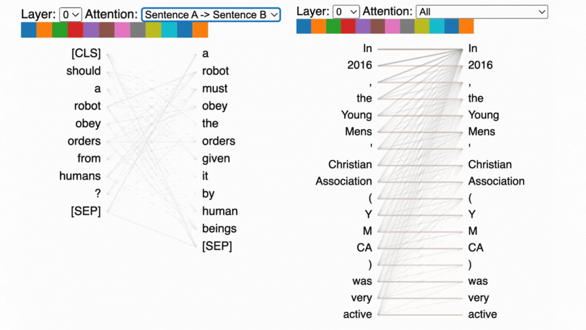
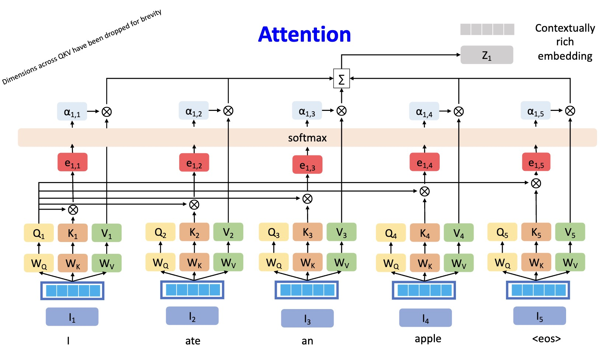

# Self-Attention: When a Sequence Attends to Itself

---

## 1. From General Attention to Self-Attention

From the previous lectures, we have the attention operator:

$$
\boxed{\text{Attention}(Q, K, V)=
\text{softmax}\left(\frac{Q K^T}{\sqrt{d_k}}\right) V}
$$

This defines a general mechanism:

* Queries retrieve information
* Keys determine relevance
* Values carry content

Now we consider a specific and fundamental case:

> What happens when $Q$, $K$, and $V$ are all derived from the same sequence?

---

## 2. The Self-Attention Setting

Let the input sequence be:

$$
X \in \mathbb{R}^{n \times d_{\text{model}}}
$$

Using the learned projections:

$$
Q = X W_Q, \quad K = X W_K, \quad V = X W_V
$$

All three matrices originate from the same source $X$.

This defines **self-attention**.

---

## 3. Token-Level View

For a single token $x_i$, the output is:

$$
y_i = \sum_{j=1}^{n} \alpha_{ij} \cdot v_j
$$

where:

$$
\boxed{\alpha_{ij}=
\frac{\exp\left(\frac{q_i \cdot k_j}{\sqrt{d_k}}\right)}
{\sum_{l=1}^{n} \exp\left(\frac{q_i \cdot k_l}{\sqrt{d_k}}\right)}}
$$

Interpretation:

* Token $i$ produces a query $q_i$
* It compares against all keys $k_j$
* It aggregates all values $v_j$ using weights $\alpha_{ij}$

---

## 4. Intuition

Each token performs the following operation:

> "Given what I am looking for, which other tokens are relevant?"

Then it combines information accordingly.

This enables:

* Long-range dependency modeling
* Context-dependent representations
* Dynamic information routing across the sequence

---

## 5. Example

Consider the sentence:

$$
\text{``The animal didn't cross the street because it was too tired."}
$$

For the token "it":

* A query $q_{\text{it}}$ is computed
* It is compared with all keys
* A high score is assigned to "animal"
* The corresponding value contributes strongly to the output

Thus, the representation of "it" becomes context-aware.

---

## 6. Summary

$$
\begin{array}{|c|}
\hline
\textbf{INPUT: Token embeddings } x_1, x_2, \dots, x_n \\
\hline
\downarrow \\
\hline
\textbf{STAGE 1: Linear projections} \\
q_i = x_i W_Q \quad \text{(query)} \\
k_i = x_i W_K \quad \text{(key)} \\
v_i = x_i W_V \quad \text{(value)} \\
\hline
\downarrow \\
\hline
\textbf{STAGE 2: Compatibility scores} \\
S_{ij} = \frac{q_i \cdot k_j}{\sqrt{d_k}} \\
\alpha_{ij} = \text{softmax}_j(S_{ij}) \\
\hline
\downarrow \\
\hline
\textbf{STAGE 3: Weighted aggregation} \\
y_i = \sum_{j=1}^{n} \alpha_{ij} v_j \\
\hline
\downarrow \\
\hline
\textbf{OUTPUT: Context-aware representations} \\
\hline
\end{array}
$$
