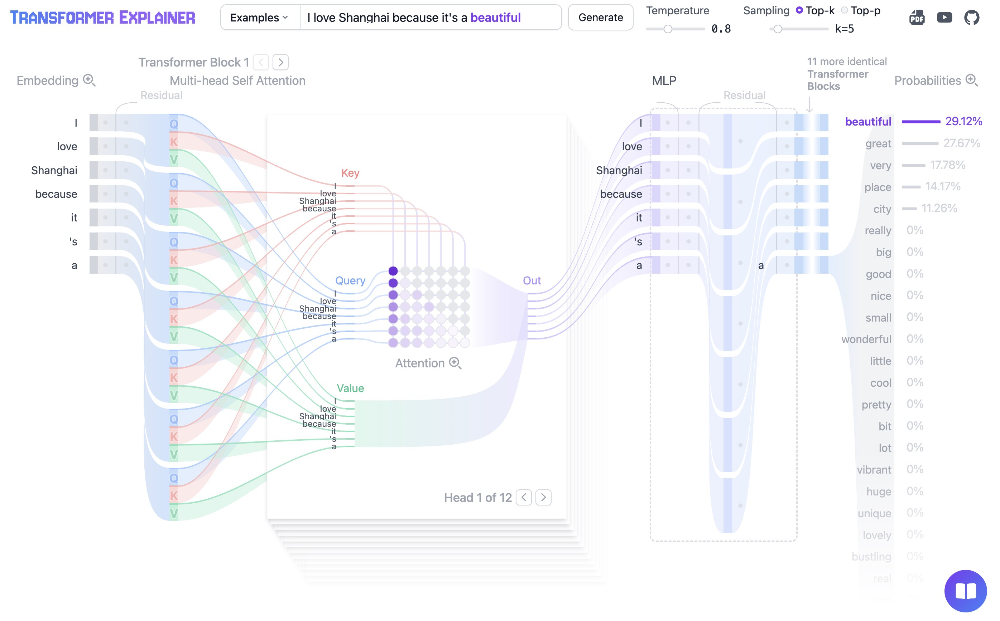
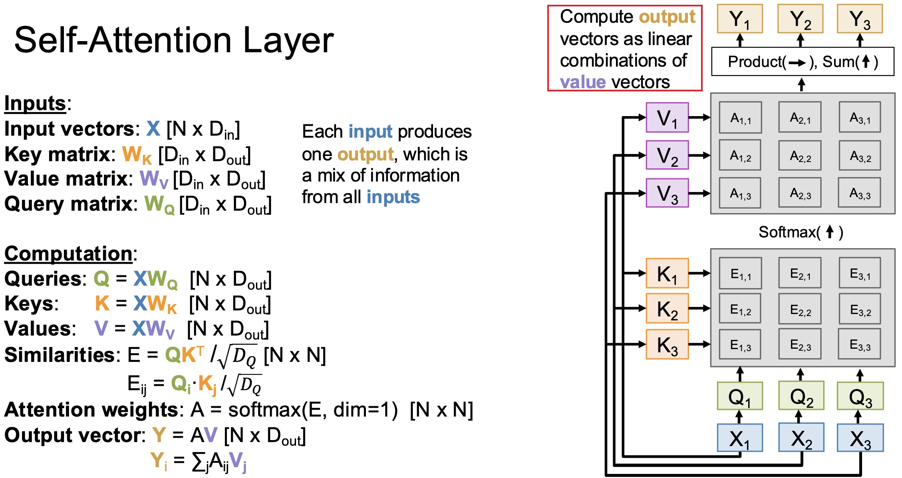
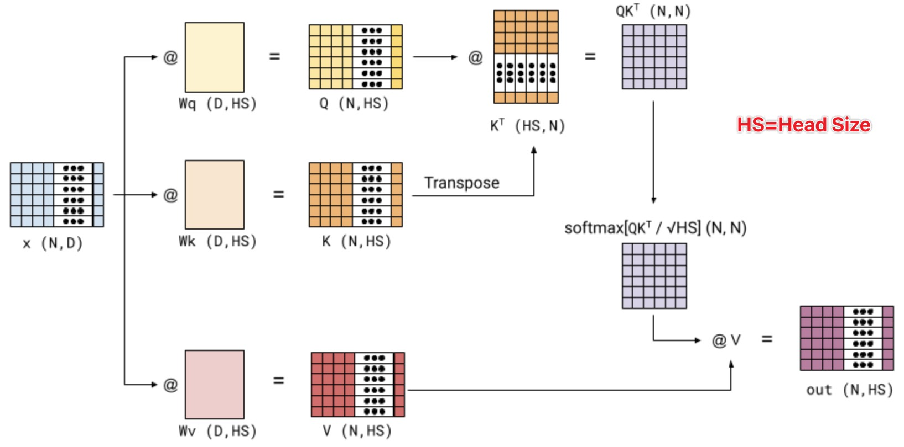

# Self-Attention in Matrix Form



---

## 1. From Token-Level to Matrix Computation (again)

We have already seen the matrix form of attention in earlier lectures when introducing Q, K, V and scaling. However, those discussions focused on *how the computation works internally*, rather than how it is organized across a full sequence.

In our previous lecture, we described attention at the **token level**:

$$
y_i = \sum_{j=1}^{n} \alpha_{ij} \cdot v_j
$$

with:

$$
\alpha_{ij}=
\frac{\exp\left(\frac{q_i \cdot k_j}{\sqrt{d_k}}\right)}
{\sum_{l=1}^{n} \exp\left(\frac{q_i \cdot k_l}{\sqrt{d_k}}\right)}
$$

This makes the computation of a single token explicit: one query interacts with all keys to produce one output.

The matrix form does not introduce a new mechanism. It simply reorganizes these per-token computations so that all queries are processed in parallel over the same set of key-value interactions.


---

## 2. Input and Linear Projections

Let the input sequence be:

$$
X \in \mathbb{R}^{n \times d_{\text{model}}}
$$

We project it into three representation spaces:

$$
Q = X W_Q,\quad K = X W_K,\quad V = X W_V
$$

where:

* $Q, K \in \mathbb{R}^{n \times d_k}$
* $V \in \mathbb{R}^{n \times d_v}$

Each row corresponds to a token embedding in a different role space.

---

## 3. Score Matrix



We compute all pairwise similarities:

$$
S = Q K^T
$$

where:

$$
S \in \mathbb{R}^{n \times n}, \quad S_{ij} = q_i \cdot k_j
$$

Each row $i$ contains the compatibility between query $q_i$ and all keys.

### Interpretation of $S$

$$
\begin{array}{c|ccccc}
& k_1 & k_2 & k_3 & \dots & k_n \\
\hline
q_1 & S_{11} & S_{12} & S_{13} & \dots & S_{1n} \\
q_2 & S_{21} & S_{22} & S_{23} & \dots & S_{2n} \\
q_3 & S_{31} & S_{32} & S_{33} & \dots & S_{3n} \\
\vdots & \vdots & \vdots & \vdots & \ddots & \vdots \\
q_n & S_{n1} & S_{n2} & S_{n3} & \dots & S_{nn}
\end{array}
$$


* $S_{ij} > 0$: strong compatibility
* $S_{ij} < 0$: weak or opposing compatibility
* $S_{ij} = 0$: neutral relation

---

## 4. Normalization

We apply row-wise softmax on the scaled similarity scores $S$:

$$
A = \text{softmax}(\frac{S}{\sqrt{d_k}})
$$

so that:

$$
A_{ij} = \alpha_{ij}, \quad \sum_{j=1}^{n} A_{ij} = 1
$$


$$
\begin{array}{c|ccccc}
& 1 & 2 & 3 & \dots & n \\
\hline
1 & \alpha_{11} & \alpha_{12} & \alpha_{13} & \dots & \alpha_{1n} \\
2 & \alpha_{21} & \alpha_{22} & \alpha_{23} & \dots & \alpha_{2n} \\
\vdots & \vdots & \vdots & \vdots & \ddots & \vdots \\
n & \alpha_{n1} & \alpha_{n2} & \alpha_{n3} & \dots & \alpha_{nn}
\end{array}
$$


Each row defines a probability distribution over all tokens.

---

## 5. Weighted Aggregation

We compute the output as:

$$
Y = A V
$$

where:

$$
Y \in \mathbb{R}^{n \times d_v}
$$

Each output row is:

$$
y_i = \sum_{j=1}^{n} A_{ij} v_j
$$

So each token becomes a mixture of all value vectors.

---

## 6. Final Matrix Form



The full self-attention operation is:


$$
\boxed{\text{Attention}(X)=
\text{softmax}\left(\frac{Q K^T}{\sqrt{d_k}}\right) V}
$$

or, more generally:

$$
\boxed{\text{Attention}(Q, K, V)=
\text{softmax}\left(\frac{Q K^T}{\sqrt{d_k}}\right) V}
$$


---


## 7. The nanochat Implementation

Let's examine how Q, K, V are implemented in nanochat's `CausalSelfAttention`:

```python
class CausalSelfAttention(nn.Module):
        # ...
        # ...
    def forward(self, x, ve, cos_sin, window_size, kv_cache):
        # B (Batch size): the number of sequences processed in parallel
        # T (Time / sequence length / n): the number of tokens in each sequence
        # C (Channel / embedding dimension / d_model): the feature size of each token
        B, T, C = x.size()
        
        # Project input to Q, K, V
        # Shape: (Batch, Time, Heads, HeadDim)
        q = self.c_q(x).view(B, T, self.n_head, self.head_dim)
        k = self.c_k(x).view(B, T, self.n_kv_head, self.head_dim)
        v = self.c_v(x).view(B, T, self.n_kv_head, self.head_dim)
        # ...
        # ...
        return y
```

* `c_q`, `c_k`, `c_v` are the learned projection matrices ($W_Q$, $W_K$, $W_V$)
* `.view()` is PyTorch’s **reshape operation**.
    * It **returns a new tensor sharing the same underlying data** but with a different shape.
    * The **total number of elements must remain the same**, otherwise an error occurs.
    * `.view(B, T, H, D)` **reinterprets the original `(B, T, C)` tensor** as multiple heads (`H`) each with `D = head_dim` features, without changing the underlying data.
* head_dim = $d_k$ = $d_q$ (usually we don't see $d_q$ because it's always equal to $d_k$; recap: $\text{Score} = Q K^T$)


