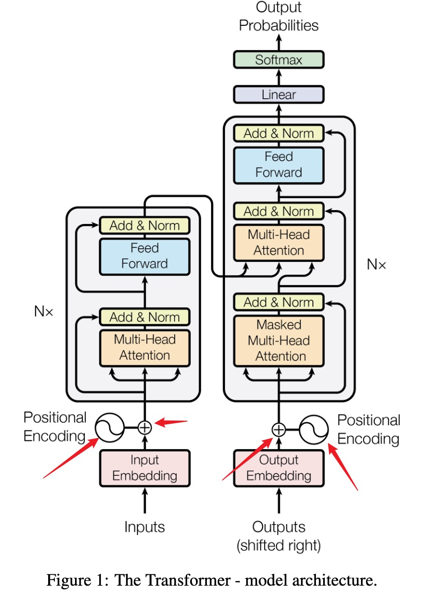

# Positional Encoding: Why Order Matters

---

> [!INFO]
> - https://huggingface.co/blog/designing-positional-encoding

## 1. The Missing Ingredient in Self-Attention

Let a sequence of $n$ tokens be represented as

$$
x_i \in \mathbb{R}^{1 \times d_{\text{model}}}
$$

Stacked row-wise:

$$
X =
\begin{bmatrix}
x_0 \\
x_1 \\
\vdots \\
x_{n-1}
\end{bmatrix}
\in \mathbb{R}^{n \times d_{\text{model}}}
$$

Self-attention directly uses token vectors, but there is no explicit position signal in this representation.

> [!WARNING]
> Without extra position information, self-attention can treat a sequence like an unordered collection of token vectors.

---

## 2. Why Order Is Semantically Critical

Consider the sentences:

- dog bites man
- man bites dog

They contain the same words but different meanings. If the model only knows which tokens appear, but not their order, these two cases become hard to distinguish.

---

## 3. Where Order Is Missing in the Computation

Self-attention uses

$$
Q=XW_Q, \quad K=XW_K, \quad V=XW_V
$$

and

$$
\operatorname{Attn}(X)=\operatorname{softmax}\!\left(\frac{QK^T}{\sqrt{d_k}}\right)V
$$

No term explicitly injects index $i$.

---

## 4. Permutation Equivariance

For a permutation matrix $P \in \mathbb{R}^{n\times n}$,

$$
\operatorname{Attn}(PX)=P\operatorname{Attn}(X)
$$

This means reordering inputs reorders outputs in the same way.

> [!INFO]
> This property is permutation equivariance, not permutation invariance.

---

## 5. Core Fix

Inject position into each token before attention:

$$
\tilde{x}_i=x_i+p_i, \quad i \in \{0,1,\dots,n-1\}
$$

Equivalently,

$$
\tilde{X}=X+PE
$$

Now each token carries both content and location.
