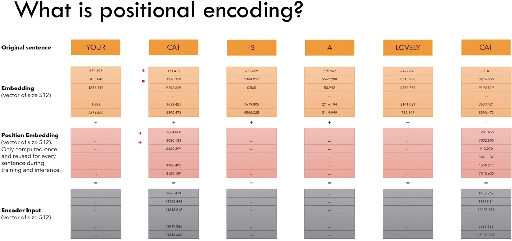

# Positional Encoding: How RNN and CNN Encode Order Implicitly

---

## 1. Why RNN/CNN Did Not Need Explicit Positional Encoding

Before Transformers, many sequence models encoded order through architecture itself.

---

## 2. Order in RNN

An RNN updates hidden state as

$$
h_t=f(h_{t-1},x_t)
$$

Because computation is sequential, the model inherently processes inputs in time order.

---
### Consequence

- $x_t$ cannot be evaluated independently of earlier steps.
- Computation order and token order are tightly coupled.

---

## 3. Order in 1D CNN

A 1D convolution for sequence position $i$ can be written as

$$
h_i=\sum_{\Delta=-k}^{k} w_{\Delta}x_{i+\Delta}
$$

This creates local neighborhoods centered at each position.

---
### Consequence

- The architecture encodes locality.
- Relative placement such as left/right context is structurally defined.

---

## 4. Why Transformer Is Different

Transformer self-attention is parallel and symmetric with respect to row order unless positional signals are injected.

> [!INFO]
> RNN and CNN carry order in their computation graph; vanilla self-attention does not.
