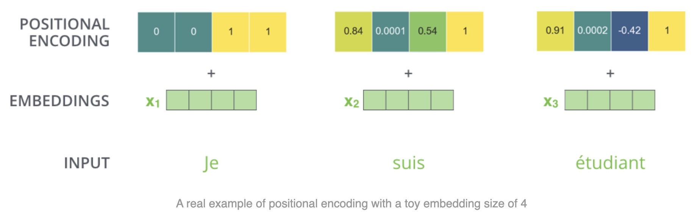

# Positional Encoding: Add Position as an Input Signal

---
## 1. Basic Rule

For each token index $i$,

$$
\tilde{x}_i=x_i+p_i
$$

with

$$
x_i,p_i\in\mathbb{R}^{1\times d_{\text{model}}}, \quad i=0,1,\dots,n-1
$$

Stacked form:

$$
\tilde{X}=X+PE, \quad \tilde{X},X,PE\in\mathbb{R}^{n\times d_{\text{model}}}
$$

---
## 2. Interpretation

- $x_i$ represents token content.
- $p_i$ represents token location.
- $\tilde{x}_i$ is a joint content-location representation.

---
## 3. Why This Is Sufficient in Principle

Using $\tilde{X}$ in projections,

$$
Q=\tilde{X}W_Q, \quad K=\tilde{X}W_K, \quad V=\tilde{X}W_V
$$

makes similarity scores depend on both content and position.

---
## 4. Next Design Question

What should $p_i$ look like so that it is smooth, expressive, and scalable to longer sequences?
