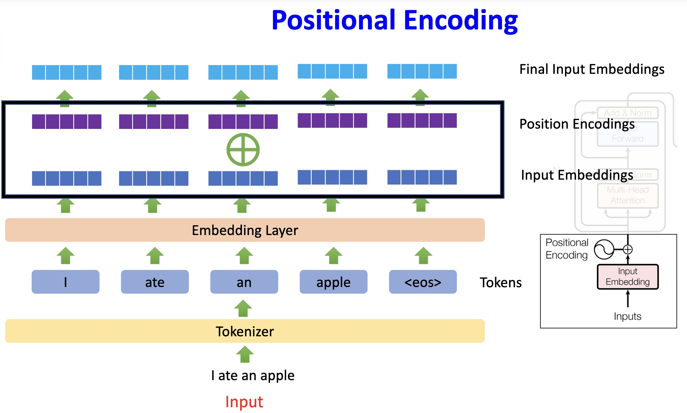

#  What Is a Good Position Representation?

---
## 1. Goal

We need a useful positional vector in

$$
\tilde{x}_i=x_i+p_i
$$

---
## 2. Naive Options and Their Limits

### Scalar index

$$
p_i=i
$$

This is a scalar, not a $d_{\text{model}}$-dimensional vector.

### One-hot index

A one-hot position vector solves dimensionality in a trivial way but introduces practical issues:

- dimension grows with maximum length
- weak extrapolation beyond trained length
- no smooth notion that nearby positions should be similar

---
## 3. Desired Properties

A good positional representation should satisfy:

1. Dimensional compatibility

$$
p_i\in\mathbb{R}^{1\times d_{\text{model}}}
$$

2. Smoothness with respect to $i$
3. Extrapolation to longer sequences
4. Relative-position information

---
## 4. Functional View

Reframe the problem as

$$
p_i=f(i), \quad i\in\{0,1,\dots,n-1\}
$$

Now we only need to choose a good function $f$.
