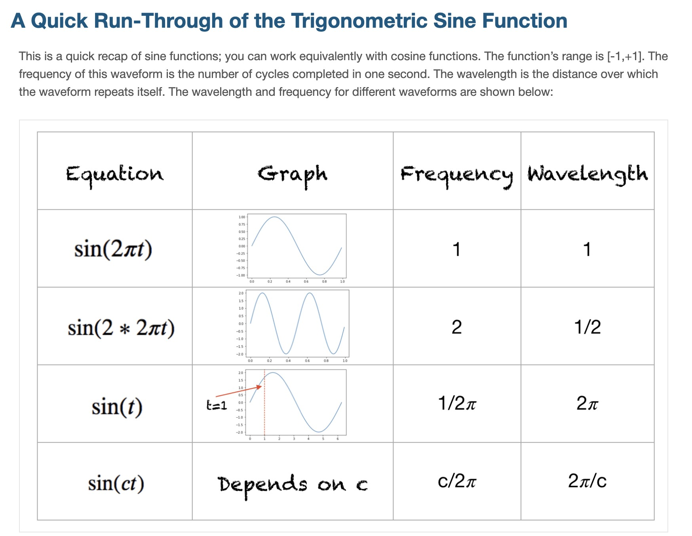

# Positional Encoding: Sine and Cosine as Position Signals

---
## 1. Core Idea

Use periodic continuous functions to map index to vector components:

$$
\sin(\omega i), \quad \cos(\omega i)
$$

---
## 2. Why These Functions Are Attractive

### Smoothness

Nearby indices map to nearby values.

### Bounded scale

Sine and cosine values remain in a fixed range.

### Phase representation

The pair

$$
\cos(\omega i), \sin(\omega i)
$$

acts like a phase coordinate.

---
## 3. Minimal Construction

$$
p_i=\sin(\omega i), \cos(\omega i)
$$

---
## 4. Limitation of a Single Frequency

Because periodicity repeats, one frequency cannot uniquely encode long positions.

> [!WARNING]
> If one sinusoid repeats every period, distant positions can collide.

---
## 5. Next Step

Use multiple frequencies simultaneously.
