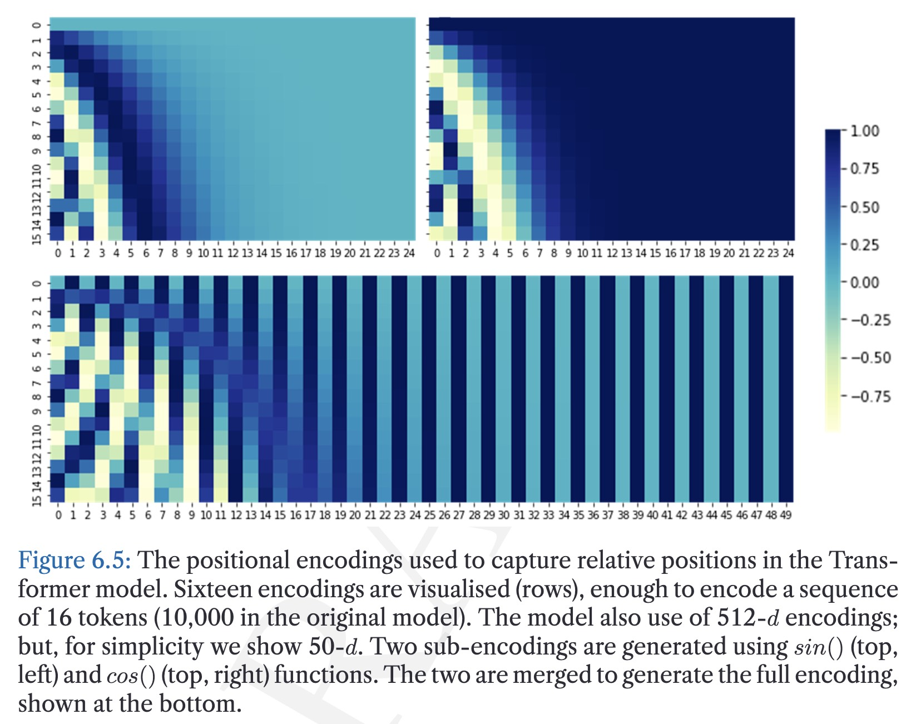
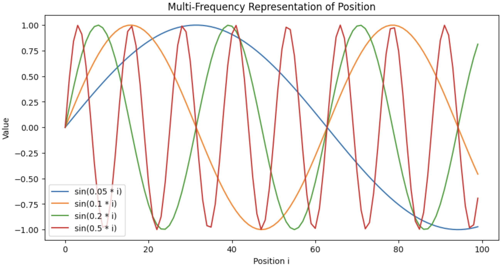

# Positional Encoding: Multi-Frequency Construction

---
## 1. Why Single Frequency Is Not Enough

A single sinusoid is periodic, so it repeats and creates ambiguity over long ranges.

---
## 2. Multi-Frequency Vector

Use many sine-cosine components:

$$
p_i=
\sin(\omega_0 i),
\cos(\omega_0 i),
\sin(\omega_1 i),
\cos(\omega_1 i),
\ldots,
\sin(\omega_{m-1} i),
\cos(\omega_{m-1} i)
$$

with

$$
m=\frac{d_{\text{model}}}{2}
$$

---
## 3. Multi-Scale Intuition

- high frequency captures fine local differences
- low frequency captures broader structure

---
## 4. Why This Improves Distinguishability

For two positions $i$ and $j$ to collide exactly, every corresponding component must match:

$$
\sin(\omega_k i)=\sin(\omega_k j), \quad \cos(\omega_k i)=\cos(\omega_k j), \quad \forall k
$$

This simultaneous alignment across all frequencies is far more restrictive than matching a single sinusoid.

> [!INFO]
> Combining frequencies dramatically lowers collision risk and improves long-range distinguishability.
