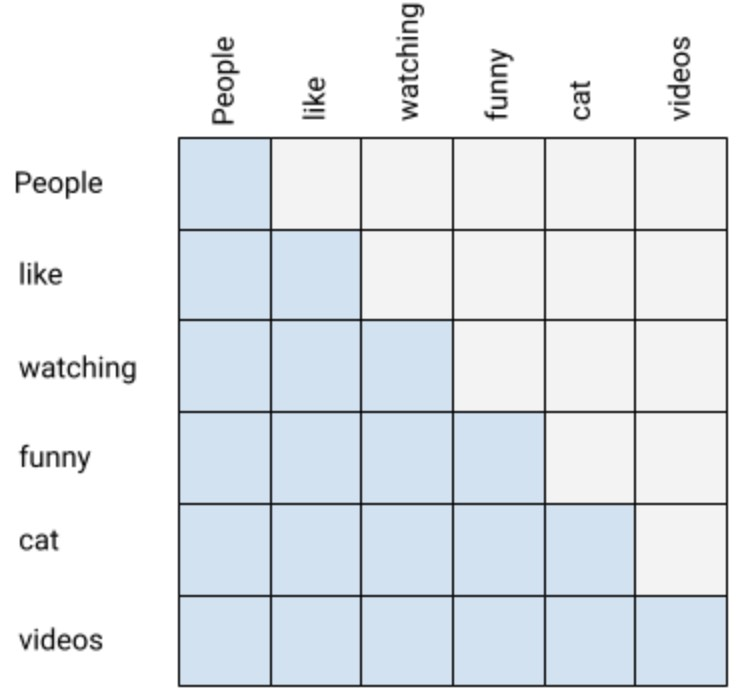
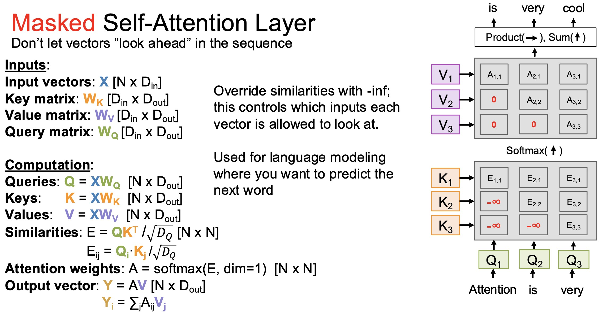

# Causal Mask and Autoregressive Modeling



---

## 1. Motivation

Many sequence modeling tasks require generating outputs **one token at a time**.

Examples:

* Language modeling
* Text generation (e.g., GPT-style models)
* Code generation

In these tasks, the model must obey a fundamental constraint:

> At position $t$, the model can only use information from positions $1$ to $t$.

This is called the **autoregressive property**.

---

## 2. The Autoregressive Objective

In language modeling, we want to learn:

$$
P(x_1, x_2, \dots, x_T)
= \prod_{t=1}^{T} P(x_t \mid x_{<t})
$$

At each step:

* Input: past tokens $x_1, \dots, x_{t-1}$
* Output: prediction for $x_t$

---

### Key Constraint

> The model must not use future tokens $x_{t+1}, \dots, x_T$

---

## 3. The Problem with Standard Self-Attention

Recall the attention mechanism:

$$
\text{Attention}(Q, K, V)
= \text{softmax}\left(\frac{QK^T}{\sqrt{d_k}}\right)V
$$

Where:

* $Q \in \mathbb{R}^{T \times d_k}$ = query matrix
* $K \in \mathbb{R}^{T \times d_k}$ = key matrix
* $V \in \mathbb{R}^{T \times d_v}$ = value matrix

This allows:

* Every position $i$ to attend to every position $j$

In graph terms:

```
i → 1, 2, ..., T
```

This includes edges:

$$
i \rightarrow j \quad \text{for } j > i
$$

These are **future edges**, which violate the autoregressive constraint.

---

### Consequence

Without restriction, the model learns:

$$
P(x_t \mid x_1, \dots, x_T)
$$

This leads to:

* Information leakage
* Poor generalization during inference

---

## 4. Causal Mask: Enforcing Temporal Order




To fix this, we introduce the **causal mask**.

---

### Definition

We define a mask matrix $M$:

$$
M_{ij} =
\begin{cases}
0 & i \ge j \\
-\infty & i < j
\end{cases}
$$

This ensures:

* Position $i$ can attend to positions $j \le i$
* Position $i$ cannot attend to positions $j > i$

---

### Structure

The mask forms a **lower-triangular matrix**:

```
Position:  1    2    3    4
        ┌────┬────┬────┬────┐
    1   │ 0  │-inf│-inf│-inf│
    2   │ 0  │ 0  │-inf│-inf│
    3   │ 0  │ 0  │ 0  │-inf│
    4   │ 0  │ 0  │ 0  │ 0  │
        └────┴────┴────┴────┘
```

---

## 5. Masked Attention Formula

We modify attention as:

$$
\text{MaskedAttention}(Q, K, V)
= \text{softmax}\left(\frac{QK^T}{\sqrt{d_k}} + M\right)V
$$

Where:

* $Q \in \mathbb{R}^{T \times d_k}$ = query matrix
* $K \in \mathbb{R}^{T \times d_k}$ = key matrix
* $V \in \mathbb{R}^{T \times d_v}$ = value matrix

Because of $-\infty$:

$$
\alpha_{ij} = 0 \quad \text{for } j > i
$$

So future edges are completely removed.

---

## 6. Graph Interpretation

From the graph perspective:

Without mask:

```
1 → 1, 2, 3, 4
2 → 1, 2, 3, 4
3 → 1, 2, 3, 4
4 → 1, 2, 3, 4
```

With causal mask:

```
1 → 1
2 → 1, 2
3 → 1, 2, 3
4 → 1, 2, 3, 4
```

> All future edges are removed.

---

## 7. Training vs Inference

### During Training

* The full sequence $x_1, \dots, x_T$ is available
* We compute all positions **in parallel**
* The causal mask ensures correctness

---

### During Inference

* Tokens are generated one by one
* At step $t$, only $x_1, \dots, x_{t-1}$ exist

The model naturally satisfies:

$$
P(x_t \mid x_1, \dots, x_{t-1})
$$

---

### Key Insight

> The causal mask makes **parallel training equivalent to sequential generation**

---

## 8. Where It Is Used

Causal masking is essential in:

* **Decoder-only models** (e.g., GPT)

  * Every layer uses causal self-attention

* **Decoder in encoder-decoder models**

  * Self-attention uses causal mask
  * Cross-attention does not


---

## 9. From nanochat:  Causal Masking

In nanochat's implementation, the causal mask is handled efficiently using PyTorch's `torch.where`:

```python
# From nanochat/nanochat/gpt.py - CausalSelfAttention class
att = (q @ k.transpose(-2, -1)) * (1.0 / math.sqrt(k.size(-1)))
# Apply causal mask
att = att.masked_fill(self.mask[:, :, :T, :T] == 0, float('-inf'))
att = F.softmax(att, dim=-1)
```

The `mask` is pre-registered as a buffer:

```python
# In __init__
self.register_buffer("mask", torch.tril(
    torch.ones(config.block_size, config.block_size)
).view(1, 1, config.block_size, config.block_size))
```

This stores the **lower-triangular matrix** (1 = can attend, 0 = cannot attend) and uses `masked_fill` to set masked positions to `-inf`.
