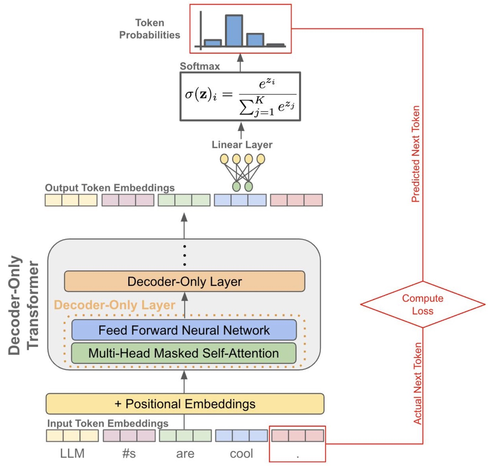

# Decoder-Only Models — Causal Language Modeling (CLM)



---

## 1. Setting: Autoregressive Modeling

Given a sequence:

$$
x_1, x_2, \dots, x_T
$$

A decoder with causal masking produces:

$$
h_t = \text{Decoder}(x_1, \dots, x_t)
$$

---

### Property

* position $t$ sees only $x_{\leq t}$
* no access to future tokens

---

## 2. Prediction Objective

We define next-token prediction:

$$
P(x_t \mid x_{<t})
$$

---

### Position-Level Loss

$$
\mathcal{L}_t = -\log P(x_t \mid x_{<t})
$$

### Sequence Objective

$$
\mathcal{L} = \sum_{t=1}^{T} \mathcal{L}_t
$$

---

### Key Insight

> model learns to predict the sequence one step at a time

---

## 3. Shift and Alignment

To implement this objective, we align inputs and targets:

```text
input:  x_1   x_2   x_3   ... x_{T-1}
label:  x_2   x_3   x_4   ... x_T
```

---

### Interpretation

At position $t$:

* input provides $x_{<t}$
* target is $x_t$

---

### Result

> next-token prediction becomes a supervised learning problem

---

## 4. Causal Masking

The decoder applies a mask:

* blocks attention to future tokens
* enforces autoregressive structure

---

### Effect

$$
h_t = f(x_{\leq t})
$$

---

### Key Role

> ensures the model cannot access $x_{>t}$

---

## 5. Parallel Training (Teacher Forcing)

During training:

* the full sequence is known
* inputs use ground-truth tokens

---

### Consequence

All losses can be computed simultaneously:

$$
\mathcal{L}_1, \dots, \mathcal{L}_T
$$

---

### Key Insight

> parallelism comes from teacher forcing + masking

---

## 6. What Is Learned

CLM models:

$$
P(x_1, \dots, x_T) = \prod_{t=1}^{T} P(x_t \mid x_{<t})
$$

---

### Result

* sequential generation
* coherent text modeling
* autoregressive behavior

---

### Representative Model

* GPT
