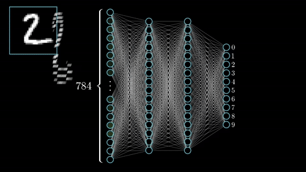
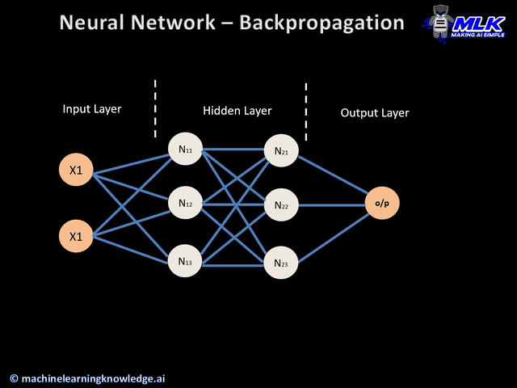

# Neural Networks — Forward Propagation

---

## 1. Single-Layer Recap

For a single layer:

$$
a = f(x W + b)
$$

* $x \in \mathbb{R}^{1 \times d}$ — input row vector
* $W \in \mathbb{R}^{d \times n}$ — weight matrix
* $b \in \mathbb{R}^{1 \times n}$ — bias row vector
* $f$ — activation function
* $a \in \mathbb{R}^{1 \times n}$ — output activation

This is the fundamental building block for deeper networks.

---

## 2. Multi-Layer Recursion

For layer $l$ in a network with $L$ layers:

$$
z^{(l)} = a^{(l-1)} W^{(l)} + b^{(l)}
$$

$$
a^{(l)} = f^{(l)}(z^{(l)})
$$

* $a^{(0)} = x$
* Repeat this process for $l = 1, 2, \dots, L$

---

## 3. Final Output

The network's prediction is the activation of the output layer:

$$
\hat{y} = a^{(L)}
$$

This could be a scalar (regression), a probability (binary classification), or a probability vector (multiclass classification).

---

## 4. Intuition

Each layer **transforms the representation** of the input:

* Early layers → low-level features
* Middle layers → intermediate patterns
* Later layers → high-level abstract representation

Forward propagation is just **applying linear + nonlinear transformations repeatedly**.
