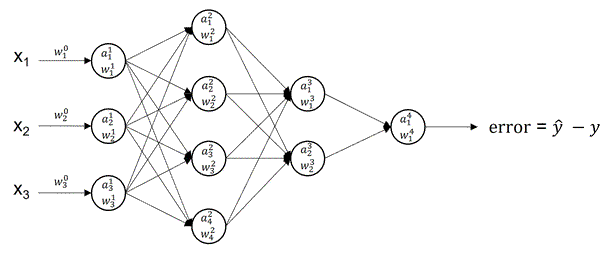

# Backpropagation — The Core: Chain Rule

---

## 1. Motivation

In a deep network, the loss depends on each parameter through a long chain of composed functions. Computing gradients directly is impractical. The **chain rule** lets us decompose these derivatives into **manageable, local pieces**.

---

## 2. Single-Variable Chain Rule

If a function is nested:

$$
y = f(g(x))
$$

Then:

$$
\underbrace{\frac{dy}{dx}}_{\text{total derivative}} = \underbrace{\frac{dy}{dg}}_{\text{outer derivative}} \, \underbrace{\frac{dg}{dx}}_{\text{inner derivative}}
$$

Example:

$$
y = (3x + 1)^2
$$

$$
u = 3x + 1
$$

$$
\frac{dy}{dx} = \frac{dy}{du} \, \frac{du}{dx} = 2u \cdot 3 = 6(3x + 1)
$$

**Takeaway:** The chain rule decomposes a derivative into **local contributions**.

---

## 3. Multi-Variable Chain Rule

For a function of multiple variables:

$$
z = f(x, y), \quad x = g(t), \quad y = h(t)
$$

The derivative of $z$ w.r.t. $t$ is:

$$
\underbrace{\frac{dz}{dt}}_{\text{total derivative}} = \underbrace{\frac{\partial z}{\partial x}}_{\text{path through } x} \, \underbrace{\frac{dx}{dt}}_{\text{rate of } x} + \underbrace{\frac{\partial z}{\partial y}}_{\text{path through } y} \, \underbrace{\frac{dy}{dt}}_{\text{rate of } y}
$$

**Interpretation:** If multiple paths influence $z$, each path contributes **additively** to the total derivative.

---

## 4. Applying to Neural Networks

A neural network is a **chain of functions**:

$$
\boxed{\mathcal{L} \longleftarrow \hat{y} \longleftarrow z^{(L)} \longleftarrow a^{(L-1)} \longleftarrow \dots \longleftarrow a^{(1)} \longleftarrow z^{(1)} \longleftarrow x}
$$

* Each layer receives a **gradient signal** from the next layer
* Each layer multiplies this signal by its **local derivative**

Formally, for a scalar loss $\mathcal{L}$:

$$
\boxed{\underbrace{\frac{\partial \mathcal{L}}{\partial z^{(l)}}}_{\text{error signal at layer } l} = \underbrace{\frac{\partial \mathcal{L}}{\partial z^{(l+1)}}}_{\text{error from next layer}} \, \underbrace{\frac{\partial z^{(l+1)}}{\partial z^{(l)}}}_{\text{local derivative}}}
$$

**Interpretation:** Gradients **flow backward**, layer by layer.

---

## 5. Local Gradients

Each node in the computation graph only needs its **local derivative** plus the incoming backward signal.

For a row-vector linear layer:

$$
z = a W + b
$$

If the incoming error signal is $\delta_z = \frac{\partial \mathcal{L}}{\partial z}$, then:

$$
\frac{\partial \mathcal{L}}{\partial W} = a^T \delta_z, \quad
\frac{\partial \mathcal{L}}{\partial a} = \delta_z W^T, \quad
\frac{\partial \mathcal{L}}{\partial b} = \delta_z
$$

For an activation layer $a = f(z)$:

$$
\frac{\partial \mathcal{L}}{\partial z} = \frac{\partial \mathcal{L}}{\partial a} \odot f'(z)
$$

This is the pattern used in the full neural-network backpropagation formulas.

---

## 6. Key Takeaway

Backpropagation is the chain rule organized layer by layer: each layer receives a backward signal, multiplies by local derivatives, and passes the result to the previous layer.
