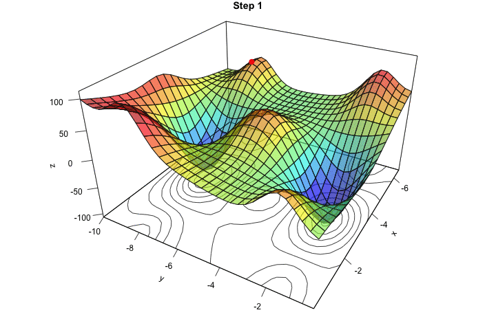

# Optimization — From Gradient to Parameter Update



> [!INFO]
> **Notation used in this optimization session**
>
> We keep the row-vector convention from `session-0/lecture-0-notation-for-session-1-to-session-7.md`:
>
> $$
> z = x W + b
> $$
>
> Optimizer formulas often show the update for $W$ only. Biases follow the same pattern:
>
> $$
> b \leftarrow b - \eta \frac{\partial \mathcal{L}}{\partial b}
> $$
>
> In this session, $g$ denotes a **parameter gradient**, such as $g = \frac{\partial \mathcal{L}}{\partial W}$.

---

## 1. What Backpropagation Gives Us

Backpropagation computes gradients. For a full dataset of $n$ training examples, the full-batch gradient for $W$ is:

$$
g = \frac{\partial \mathcal{L}}{\partial W}
  = \frac{1}{n}\sum_{i=1}^{n}\frac{\partial \ell^{(i)}}{\partial W}
$$

This gradient tells us the direction in which the loss increases fastest.

> [!INFO]
> A gradient is **information**, not yet learning.

---

## 2. The Missing Step: Update the Parameters

To make the model learn, we must use the gradient to change the parameters.

```text
backpropagation computes g
optimization uses g to update W
```

The basic optimizer is **Gradient Descent (GD)**:

$$
W \leftarrow W - \eta g
$$

where:

* $W$ — parameter being updated
* $g = \frac{\partial \mathcal{L}}{\partial W}$ — gradient of the loss with respect to $W$
* $\eta$ — learning rate

---

## 3. Why the Minus Sign?

The gradient points uphill: it points toward increasing loss.

To reduce the loss, we move in the opposite direction:

$$
- g
$$

So the update is:

$$
\text{new parameter} = \text{old parameter} - \text{step size} \times \text{gradient}
$$

or, in our update notation:

$$
W \leftarrow W - \eta g
$$

---

## 4. What the Learning Rate Controls

The learning rate $\eta$ decides how much of the gradient direction we follow in one update:

$$
\Delta W = -\eta g
$$

* Direction comes from $-g$
* Step size comes from $\eta$

This is why optimization has two separate ideas:

| Idea | Question answered |
|---|---|
| Gradient $g$ | Which direction reduces the loss? |
| Learning rate $\eta$ | How far should we move in that direction? |

The next lecture focuses entirely on choosing $\eta$.

---

## 5. What Changes in Later Optimizers?

The update shape remains recognizable:

$$
W \leftarrow W - \eta(\text{update direction})
$$

Later lectures change one piece at a time:

* **Learning rate:** how large the step is.
* **Mini-batches:** how the gradient is estimated.
* **Momentum and Adam:** how the raw gradient is smoothed or rescaled.

---

## 6. PyTorch Example

```python
import torch
import torch.nn as nn

# A linear layer follows the row-vector idea: z = x W + b
model = nn.Linear(d_in, d_out)
criterion = nn.MSELoss()

# SGD applies parameter updates using the gradients computed by backpropagation.
optimizer = torch.optim.SGD(model.parameters(), lr=0.01)

for X, y in dataloader:
    optimizer.zero_grad()      # 1. Clear gradients from the previous mini-batch
    prediction = model(X)      # 2. Forward pass
    loss = criterion(prediction, y)
    loss.backward()            # 3. Backpropagation computes gradients g
    optimizer.step()           # 4. Optimizer applies W <- W - eta * g
```

---

## 7. Summary

1. Backpropagation computes gradients.
2. Optimization updates parameters using those gradients.
3. Gradient descent uses the update rule:

$$
W \leftarrow W - \eta g
$$

4. The gradient gives the direction; the learning rate gives the step size.
