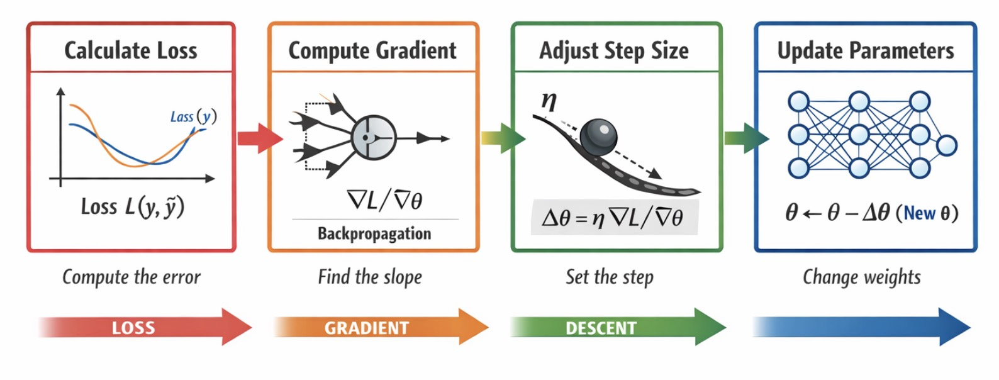
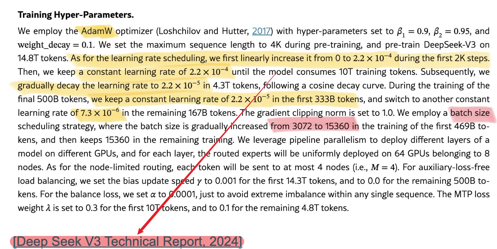

# Optimization — Learning Rate

First, open this visualization for experimentation:

- https://uclaacm.github.io/gradient-descent-visualiser/#playground

---

## 1. Review: The Update Rule



Gradient descent updates a parameter by:

$$
g = \frac{\partial \mathcal{L}}{\partial W}, \quad W \leftarrow W - \eta g
$$

The two parts should not be confused:

| Symbol | Meaning | Role |
|---|---|---|
| $g$ | Gradient | Direction and sensitivity |
| $\eta$ | Learning rate | Step-size multiplier |

---

## 2. What Does the Learning Rate Do?

The learning rate $\eta$ is a scalar hyperparameter that scales the update:

$$
\Delta W = -\eta g
$$

The learning rate does not choose the direction. It only scales the step taken in the negative-gradient direction.

---

## 3. Three Learning-Rate Regimes

### 3.1 Too Small


* Updates are tiny.
* The loss may decrease, but very slowly.
* Training wastes time and compute.

### 3.2 Too Large


* Updates jump over good parameter values.
* The loss may oscillate or diverge.
* Training can fail even when the gradient direction is correct.

### 3.3 Reasonable


* Updates are large enough to make progress.
* Updates are small enough to remain stable.
* The loss decreases efficiently.

> [!INFO]
> A bad learning rate can make a correct gradient look useless.

---

## 4. Why Learning Rate and Gradient Magnitude Interact

The actual parameter change depends on both $\eta$ and $g$:

$$
\|\Delta W\| = \eta \|g\|
$$

So instability can come from either:

* a learning rate that is too large, or
* gradients that are very large.

This is one reason deep-learning training often uses normalization, careful initialization, gradient clipping, warmup, and adaptive optimizers.

---

## 5. Practical Starting Values

Typical starting values depend on the optimizer and model:

| Situation | Common starting point |
|---|---:|
| Simple GD or mini-batch SGD | $0.01$ |
| SGD with momentum | $0.01$ |
| Adam | $0.001$ |
| Large or unstable models | smaller values plus warmup |

These values are starting points, not laws. The best value depends on the model, data, batch size, and optimizer.

---

## 6. Learning-Rate Schedules



A fixed $\eta$ is simple, but training often benefits from changing $\eta$ over time.

### Early Training

* Parameters are far from a good solution.
* Larger steps can speed up progress.

### Late Training

* Parameters are closer to a good solution.
* Smaller steps help avoid overshooting and improve fine-tuning.

---

## 7. Common Schedules

### Step Decay

Reduce $\eta$ at predefined epochs:

```text
epoch 0-30   lr = 0.01
epoch 30-60  lr = 0.001
epoch 60-90  lr = 0.0001
```

### Exponential Decay

Decrease smoothly:

$$
\eta_t = \eta_0 e^{-kt}
$$

### Cosine Decay

Vary $\eta$ smoothly with a cosine-shaped curve. This is common in modern deep-learning training.

---

## 8. Learning-Rate Warmup

Warmup starts with a very small learning rate and gradually increases it:

```text
step 0-2000  -> increase lr
step 2000+   -> decay schedule
```

Warmup helps because early gradients can be unstable. It is especially useful for large neural networks.

---

## 9. Summary

* The gradient gives direction.
* The learning rate controls step size.
* Too small means slow learning.
* Too large means oscillation or divergence.
* Schedules and warmup make training more stable.
