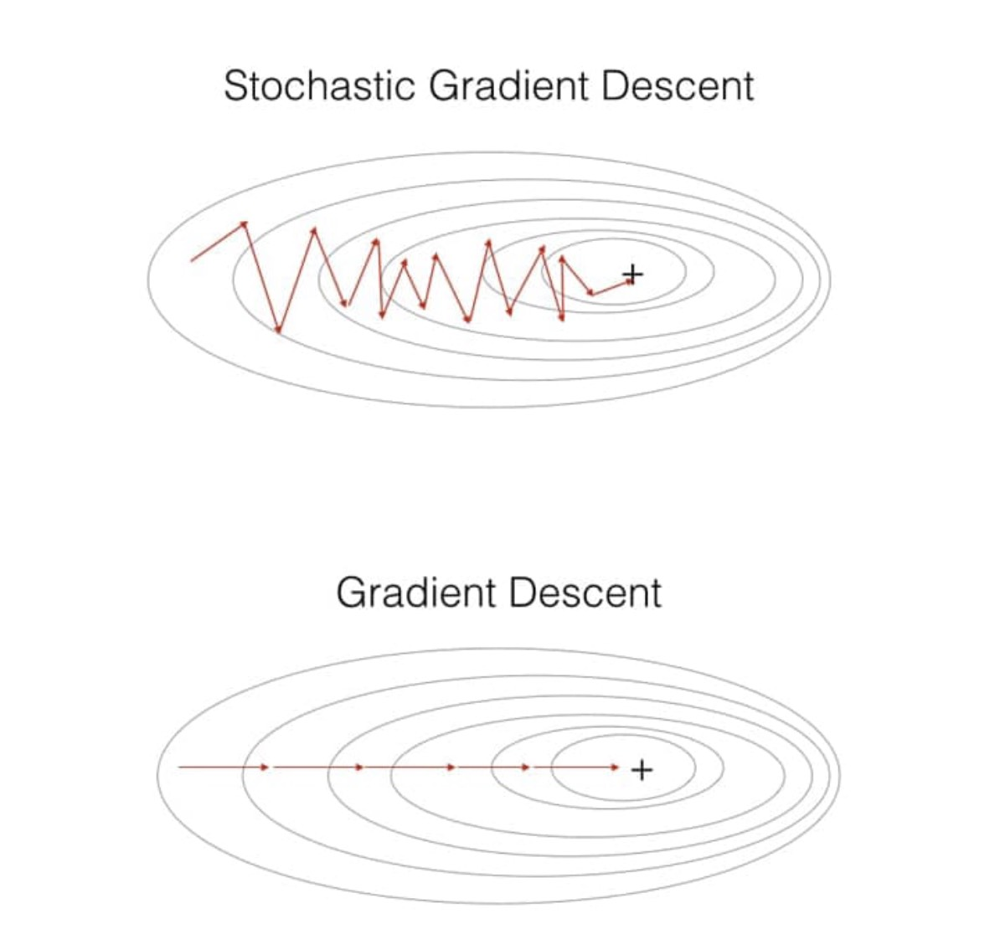
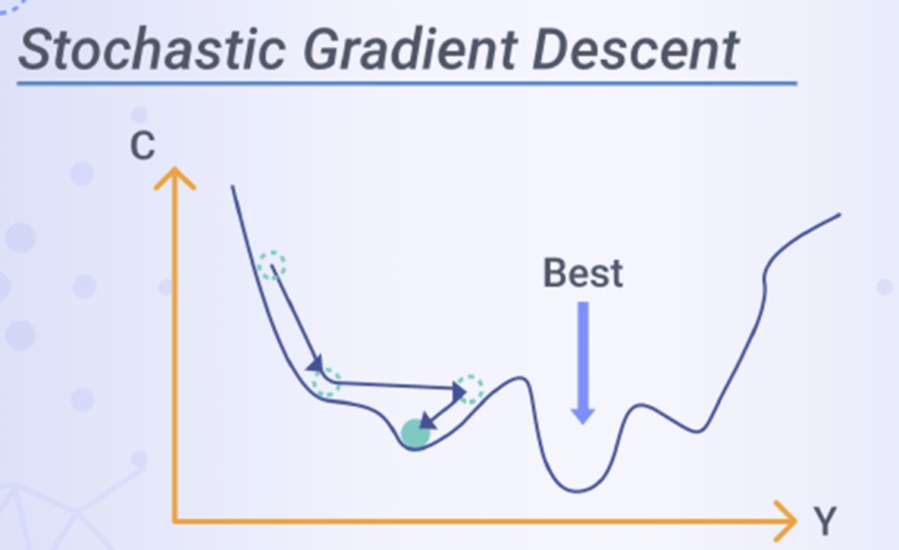

# Optimization — From Gradient Descent to Mini-Batch SGD



---

## 1. Full-Batch Gradient Descent

Full-batch gradient descent uses every training example to compute one update:

$$
g_{\text{full}} = \frac{\partial \mathcal{L}}{\partial W}
= \frac{1}{n}\sum_{i=1}^{n}\frac{\partial \ell^{(i)}}{\partial W}
$$

$$
W \leftarrow W - \eta g_{\text{full}}
$$

**Strength:** the gradient estimate is stable.

**Weakness:** each update can be expensive when $n$ is large.

---

## 2. The Core Trade-Off

Optimization repeatedly asks:

```text
How accurate does the gradient need to be for learning to progress?
```

A perfectly accurate full-dataset gradient is not always necessary. Often, an approximate gradient is enough.

---

## 3. Three Batch Choices

Let $B$ be the number of examples used for one update, and let $n$ be the total number of training examples.

| Name | Batch size | Gradient estimate | Course terminology |
|---|---:|---|---|
| Full-batch GD | $B = n$ | all examples | "GD" or "full-batch GD" |
| One-sample SGD | $B = 1$ | one example | explicitly called "one-sample SGD" |
| Mini-batch SGD | $1 < B \ll n$ | a small random batch | usually called "SGD" |

> [!INFO]
> In this course, **SGD means mini-batch SGD** unless we explicitly say "one-sample SGD."

---

## 4. Mini-Batch SGD Update

Choose a mini-batch $\mathcal{B}$ with $B$ examples. The mini-batch gradient is:

$$
g_{\mathcal{B}} = \frac{1}{B}\sum_{i\in\mathcal{B}}\frac{\partial \ell^{(i)}}{\partial W}
$$

Then update:

$$
W \leftarrow W - \eta g_{\mathcal{B}}
$$

This has the same update shape as full-batch GD. Only the gradient estimate changes.

---

## 5. Why Mini-Batches Work Well

Mini-batch SGD is popular because it balances three needs:

1. **Speed:** each update uses only part of the dataset.
2. **Stability:** averaging over $B > 1$ examples reduces noise.
3. **Hardware efficiency:** matrix operations on batches are fast on GPUs.

---

## 6. Intuition: Noisy Descent



Mini-batch gradients are noisy approximations of the full gradient:

$$
g_{\mathcal{B}} \approx g_{\text{full}}
$$

The path can look less smooth, but each step is much cheaper.


Noise can also help optimization move through flat regions or saddle points, although too much noise can make training unstable.

---

## 7. Choosing Batch Size

| Batch size | Effect |
|---|---|
| Smaller | More noisy, cheaper steps, often needs smaller $\eta$ |
| Larger | Smoother gradients, more expensive steps, often allows larger $\eta$ |

Typical starting ranges:

| Dataset/model scale | Batch size |
|---|---:|
| Small | 16-64 |
| Medium | 64-256 |
| Large | 256-1024+ |

> Batch size and learning rate should be tuned together.

---

## 8. PyTorch Example

```python
import torch
from torch.utils.data import DataLoader

# DataLoader creates mini-batches.
dataloader = DataLoader(dataset, batch_size=64, shuffle=True)

# In deep-learning practice, torch.optim.SGD is usually used with mini-batches.
optimizer = torch.optim.SGD(model.parameters(), lr=0.01)

for epoch in range(num_epochs):
    for X, y in dataloader:
        optimizer.zero_grad()
        prediction = model(X)
        loss = criterion(prediction, y)
        loss.backward()      # Computes g_B on this mini-batch
        optimizer.step()     # Applies W <- W - eta * g_B
```

---

## 9. Summary

The only change from full-batch GD to mini-batch SGD is how we estimate the gradient:

$$
g_{\text{full}} \quad \longrightarrow \quad g_{\mathcal{B}}
$$

In this course, **SGD means mini-batch SGD** unless stated otherwise.
