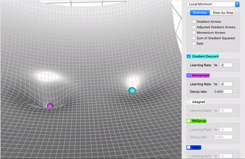
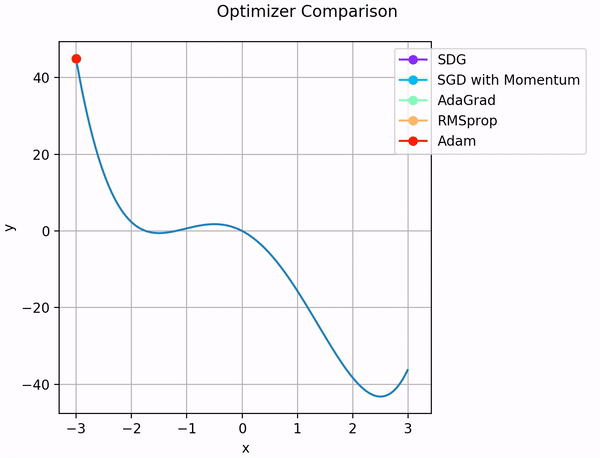

# Optimization — Momentum



---

## 1. Review — Mini-Batch SGD

From the previous lecture, mini-batch SGD uses a mini-batch gradient $g_{\mathcal{B}}$ and updates:

$$
W \leftarrow W - \eta g_{\mathcal{B}}
$$

This is efficient, but the mini-batch gradient is noisy. In narrow valleys or high-curvature directions, that noise can cause zig-zagging and slow progress.

---

## 2. Motivation for Momentum



Imagine descending a **long, narrow valley**:

* Gradient along steep direction → large updates → zig-zag path
* Gradient along shallow direction → small updates → slow progress

We want:

1. **Reduce oscillations** along steep directions
2. **Accelerate convergence** along shallow directions

**Solution:** Momentum — treat updates like a **moving ball** that accumulates velocity.

---

## 3. Momentum Update Rule

Momentum introduces a **velocity term** $v$ that smooths the mini-batch gradient over time. For readability, write $g = g_{\mathcal{B}}$ inside the update:

$$
v \leftarrow \beta v + (1 - \beta) g, \quad W \leftarrow W - \eta v
$$

The forward-pass notation is unchanged; for example, a row-vector linear layer is still $z = x W + b$. Momentum only changes the optimizer update.

> [!INFO]
> **Momentum notation vs. Adam notation**
>
> Here $v$ means **velocity**. In the Adam lecture, $v$ will mean the **second moment** (moving average of squared gradients). The meanings are different, even though the same letter is commonly used in optimizer notation.

Where:

* $g$ — mini-batch gradient $g_{\mathcal{B}}$
* $v$ — accumulated velocity (smoothed gradient)
* $\beta \in [0,1)$ — momentum coefficient (commonly 0.9)
* $\eta$ — learning rate

**Interpretation:**

* $v$ smooths the gradient over multiple steps
* $\beta$ controls how much past gradients influence the current update
* The parameter moves **faster in consistent directions** and **slows down in oscillating directions**

---

## 4. Geometric Intuition

* Without momentum → zig-zag path along steep walls
* With momentum → smooth path, like a ball rolling down the valley

Visual analogy:

* Steep, high-curvature direction → velocity cancels oscillations
* Flat, shallow direction → velocity accumulates, accelerates learning

**Key insight:** Momentum balances **stability** and **speed**.

---

## 5. Practical Tips

1. Typical momentum coefficient: $\beta = 0.9$
2. Combine with mini-batch SGD for best results
3. Works especially well for **deep networks** with **high-curvature loss surfaces**
4. Learning rate may need slight adjustment when using momentum

---

## 6. PyTorch Example

```python
import torch.optim as optim

# SGD with momentum conceptually accumulates a velocity from recent gradients
optimizer = optim.SGD(
    model.parameters(),
    lr=0.01,
    momentum=0.9  # beta = 0.9
)

for X, y in dataloader:
    optimizer.zero_grad()
    loss = criterion(model(X), y)
    loss.backward()
    optimizer.step()  # Updates parameters using momentum-smoothed gradients
```

---

## 7. Summary

Momentum changes the update direction from the raw mini-batch gradient $g_{\mathcal{B}}$ to a smoothed velocity $v$. This reduces zig-zagging and helps learning move faster in directions where gradients are consistent.
