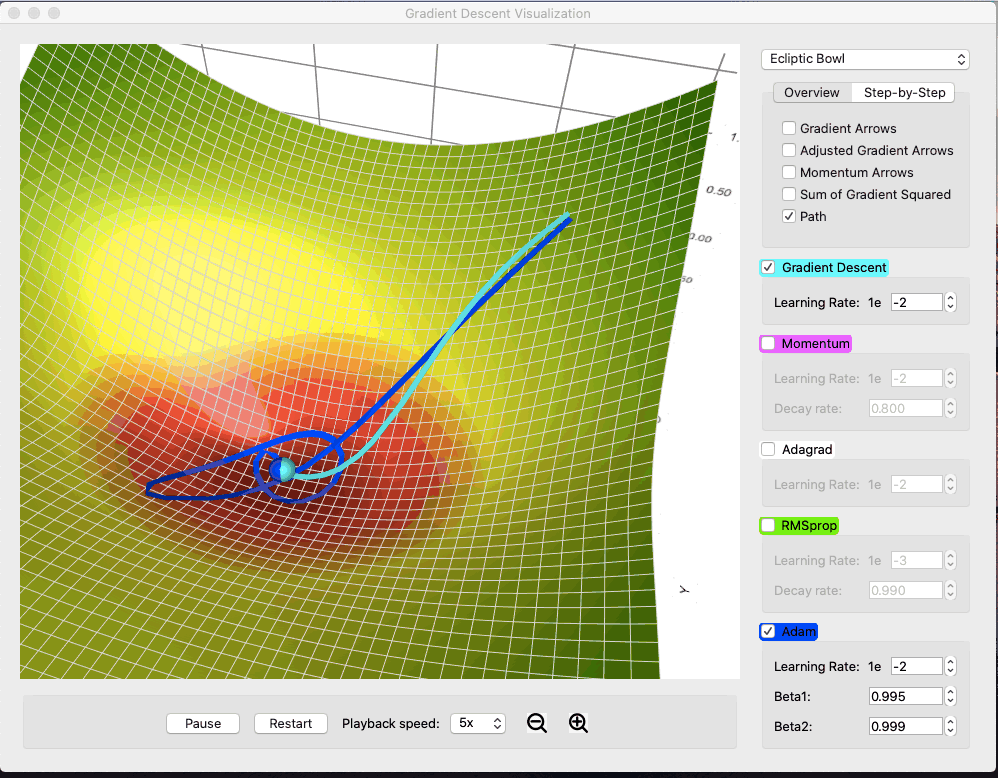
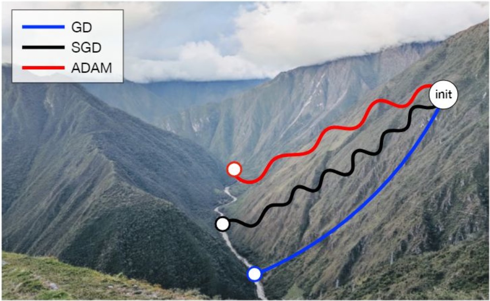

# Optimization — Adam (Adaptive Moment Estimation)


---

## 1. Motivation

From the previous lecture, **momentum** accelerates learning along consistent directions and reduces oscillations.

However, there is another issue:

* Different parameters can have **very different gradient scales**
* Using a single global learning rate may be inefficient

We need an optimizer that combines:

1. **Directional memory** (momentum)
2. **Parameter-specific adaptive step sizes**

This leads to **Adam (Adaptive Moment Estimation)**.

---

## 2. Review — From SGD to Momentum

So far:

* **Mini-batch SGD** uses a mini-batch gradient $g_{\mathcal{B}}$ for each update.
* **Momentum** smooths that gradient direction with a velocity term.

Adam keeps the smoothing idea and adds **parameter-specific scaling**.

---

## 3. Adam — First and Second Moments


For readability, write $g = g_{\mathcal{B}}$ in the formulas below. Adam tracks two moving averages of this mini-batch gradient:

### 3.1 First Moment — Mean of Gradients

$$
m^{(t)} \leftarrow \beta_1 m^{(t-1)} + (1-\beta_1) g
$$

* Similar to momentum's $v$: both smooth the raw gradient $g$
* Captures **directional trend** of gradients
* $\beta_1$ typically 0.9

> [!INFO]
> **Why $m$ instead of $v$?**
> In the momentum lecture we called the smoothed gradient $v$ (velocity). Adam uses $m$ (moment) for the same idea. Adam's $v$ is a *different* quantity — it tracks the volatility (squared gradients).

---

### 3.2 Second Moment — Mean of Squared Gradients

$$
v^{(t)} \leftarrow \beta_2 v^{(t-1)} + (1-\beta_2) g^2
$$

* Measures **gradient magnitude** using element-wise squares
* Large $v$ means recent squared gradients are large, so Adam reduces the effective step for those parameters.
* Small $v$ means recent squared gradients are small, so Adam allows a relatively larger effective step.
* $\beta_2$ typically 0.999 (long-term memory of volatility)

---

## 4. Bias Correction

Moving averages ($m^{(t)}, v^{(t)}$) are initialized at **0**. Since $\beta_1$ and $\beta_2$ are typically very close to 1 (e.g., 0.999), the moving averages are heavily "dragged" toward zero during the first few iterations.

To fix this, we compute **bias-corrected** moments:

$$
\hat{m}^{(t)} = \frac{m^{(t)}}{1-(\beta_1)^t}
$$

$$
\hat{v}^{(t)} = \frac{v^{(t)}}{1-(\beta_2)^t}
$$

> [!INFO]
> In $m^{(t)}$ and $v^{(t)}$, the superscript $(t)$ is a time-step index. In $(\beta_1)^t$ and $(\beta_2)^t$, $t$ is an exponent.

Why this matters:

* At the first step, zero initialization makes the moving averages too small.
* Bias correction rescales them so early updates are not underestimated.
* As $t$ grows, $(\beta)^t \to 0$, so the correction naturally fades away.

---

## 5. Adam Update Rule

Parameter update, applied element-wise to each parameter:

$$
W \leftarrow W - \eta \frac{\hat{m}}{\sqrt{\hat{v}} + \epsilon}
$$

Where:

* $W$ — parameters
* $\eta$ — base learning rate (typical 0.001)
* $\hat{m}$ — bias-corrected first moment
* $\hat{v}$ — bias-corrected second moment
* $\epsilon$ — small number for numerical stability (e.g., $10^{-8}$)

**Key idea:** Step size is **adapted per parameter** based on gradient history.

---

## 6. Geometric Intuition



1. **First moment $m$** → smooths noisy gradients (like momentum)
2. **Second moment $v$** → scales updates according to gradient volatility
3. **Combined effect** → move quickly along flat, stable directions and cautiously along steep, noisy directions

Analogy: A ship navigating in fog:

* Trust **consistent directions** from history → first moment
* Reduce trust in **unreliable directions** → second moment

---

## 7. Practical Defaults

| Hyperparameter       | Typical Value |
| -------------------- | ------------- |
| Learning rate $\eta$ | 0.001         |
| $\beta_1$            | 0.9           |
| $\beta_2$            | 0.999         |
| $\epsilon$           | $10^{-8}$     |

* Works well for most deep learning tasks
* Minimal tuning required

---

## 8. Why Adam Works Well

Adam combines the ideas from the previous optimization lectures:

| Previous idea | Adam version |
|---|---|
| Mini-batch gradient $g_{\mathcal{B}}$ | Uses a mini-batch gradient at every step |
| Momentum | First moment $m$ smooths gradient direction |
| Learning-rate scaling | Second moment $v$ rescales each parameter update |
| Stable early training | Bias correction fixes zero-initialized moments |

---

## 9. PyTorch Example

```python
import torch.optim as optim

optimizer = optim.Adam(
    model.parameters(),
    lr=0.001,
    betas=(0.9, 0.999), # Optional: defaults are fine
    eps=1e-8 # Optional: defaults are fine
)

for X, y in dataloader:
    optimizer.zero_grad()
    prediction = model(X)
    loss = criterion(prediction, y)
    loss.backward()
    optimizer.step()
```

---

## 10. Summary



Adam is the natural culmination of **mini-batch SGD + momentum + adaptive learning rates**: $m$ smooths direction, $v$ rescales step sizes, and bias correction keeps early updates reliable.
