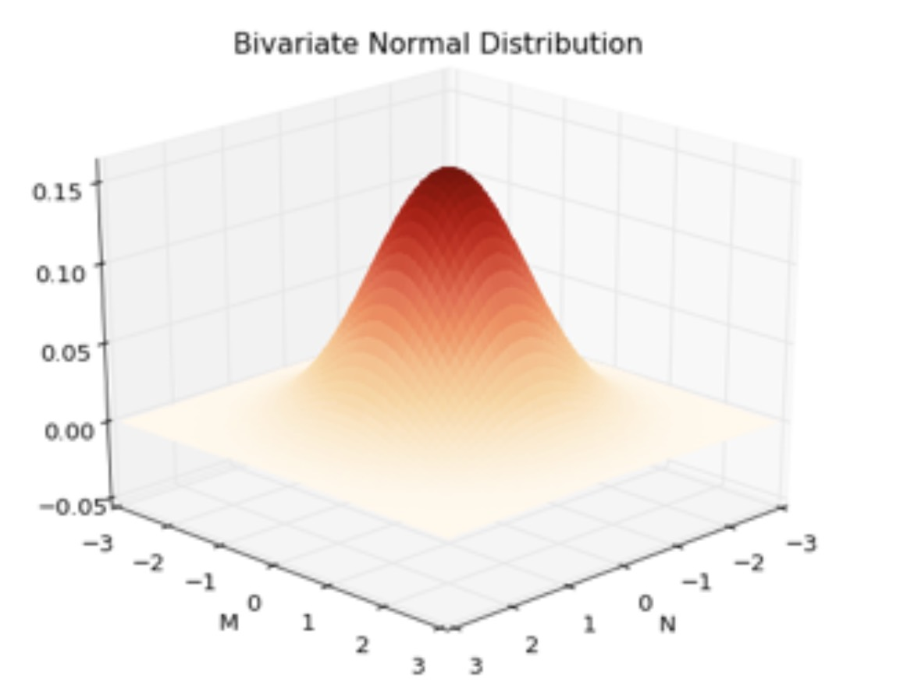
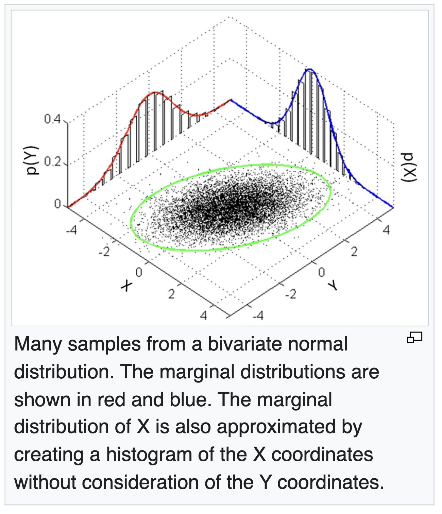
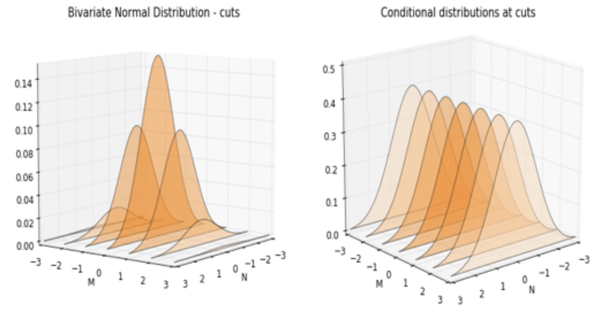
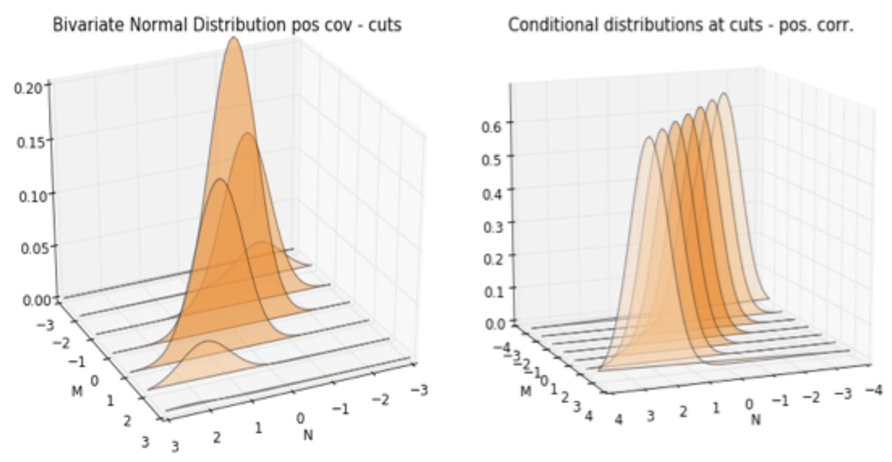

# Normal Distribution and Bivariate Normal Distribution

## 1. Motivation: Why Gaussian Structure Appears Everywhere

The normal distribution is not just a convenient assumption. It emerges naturally when many small independent effects are aggregated.

Typical appearances:

* Measurement noise in physical systems
* Aggregation of independent random effects
* Latent-variable models in machine learning
* Bayesian inference under quadratic loss

> [!INFO]
> The Gaussian distribution is the unique stable distribution under summation of independent random variables (Central Limit behavior).

---

# 2. Univariate Normal Distribution

## 2.1 Definition

A random variable $X$ is Gaussian if:

$$
X \sim \mathcal{N}(\mu, \sigma^2)
$$

with density:

$$
p(x) = \frac{1}{\sqrt{2\pi\sigma^2}} \exp\left(-\frac{(x - \mu)^2}{2\sigma^2}\right)
$$

Parameters:

* $\mu$: location (mean)
* $\sigma^2$: variance (spread)

---

## 2.2 Structural Meaning

The density is fully determined by:

* quadratic distance $(x - \mu)^2$
* exponential decay of deviation from mean

Key implication:

* probability mass is concentrated near $\mu$
* deviations are penalized quadratically

---

## 2.3 Standard Normal and Normalization

Define:

$$
Z = \frac{X - \mu}{\sigma}
$$

Then:

$$
Z \sim \mathcal{N}(0,1)
$$

This transformation removes scale and shift, leaving a universal reference distribution.

---

## 2.4 Z-score Interpretation

$$
z = \frac{x - \mu}{\sigma}
$$

Meaning:

* $z = 0$: center
* $z = 1$: one standard deviation above mean
* $z = -2$: two standard deviations below mean

This converts raw values into comparable units across distributions.

---

# 3. Variance, Covariance, and Correlation 

## 3.1 Variance

$$
\mathrm{Var}(X) = \mathbb{E}[(X - \mu_X)^2]
$$

Interpretation:

* measures intrinsic spread
* independent of external scaling

---

## 3.2 Covariance

$$
\mathrm{Cov}(X,Y) = \mathbb{E}[(X - \mu_X)(Y - \mu_Y)]
$$

Interpretation:

* positive: co-movement in same direction
* negative: opposite movement
* zero: no linear dependence

---

## 3.3 Correlation

$$
\rho = \frac{\mathrm{Cov}(X,Y)}{\sigma_X \sigma_Y}
$$

where:

$$
\sigma_X = \sqrt{\mathrm{Var}(X)}, \quad \sigma_Y = \sqrt{\mathrm{Var}(Y)}
$$

Key property:

$$
-1 \le \rho \le 1
$$

---

> [!INFO]
> Covariance encodes scale-dependent coupling. Correlation removes scale and isolates pure dependency strength.

---

# 4. Bivariate Normal Distribution

## 4.1 Definition

A joint Gaussian random vector:

$$
\mathbf{X} =
\begin{bmatrix}
X \
Y
\end{bmatrix}
\sim \mathcal{N}(\boldsymbol{\mu}, \Sigma)
$$

with:

$$
\boldsymbol{\mu} =
\begin{bmatrix}
\mu_X \
\mu_Y
\end{bmatrix}
$$

---

## 4.2 Covariance Matrix (Correct Canonical Form)

The covariance matrix is:

$$
\Sigma =
\begin{bmatrix}
\sigma_X^2 & \rho \sigma_X \sigma_Y \\
\rho \sigma_X \sigma_Y & \sigma_Y^2
\end{bmatrix}
$$

This is the canonical parameterization of a bivariate Gaussian.

---

## 4.3 Why the Off-Diagonal Term Has $\sigma_X \sigma_Y$

By definition:

$$
\mathrm{Cov}(X,Y) = \rho \sigma_X \sigma_Y
$$

Therefore:

* $\rho$ encodes pure dependency strength
* $\sigma_X \sigma_Y$ restores correct physical scaling

Units check:

* covariance has units of $X \cdot Y$
* product $\sigma_X \sigma_Y$ ensures consistency

---

## 4.4 Geometric Interpretation

The density is:

$$
p(x,y) \propto \exp\left(
-\frac{1}{2}
(\mathbf{x} - \boldsymbol{\mu})^T
\Sigma^{-1}
(\mathbf{x} - \boldsymbol{\mu})
\right)
$$

The quadratic form defines level sets:

$$
(\mathbf{x} - \boldsymbol{\mu})^T \Sigma^{-1} (\mathbf{x} - \boldsymbol{\mu}) = c
$$

These are ellipses.

Effects of correlation:

* $\rho = 0$: axis-aligned contours
* $\rho > 0$: tilt along $y = x$
* $\rho < 0$: tilt along $y = -x$

---

# 5. Marginal Distributions (Core Reduction Principle)

## 5.1 Definition

From joint distribution:

$$
p(x) = \int p(x,y),dy
$$

$$
p(y) = \int p(x,y),dx
$$

This is the operation of projecting a joint system onto a single axis.

---

## 5.2 Marginals of a Gaussian

If:

$$
(X,Y) \sim \mathcal{N}(\boldsymbol{\mu}, \Sigma)
$$

then:

$$
X \sim \mathcal{N}(\mu_X, \sigma_X^2), \quad
Y \sim \mathcal{N}(\mu_Y, \sigma_Y^2)
$$

Key result:

> Marginals of a multivariate Gaussian remain Gaussian.

---

## 5.3 Interpretation

Marginalization removes dependency structure but preserves individual distributions.

* covariance disappears from marginal form
* variance remains unchanged

---

# 6. Conditional Distributions (Core Inference Mechanism)

- https://jlcoto.github.io/visualizing-bivariate-normal

## 6.1 Definition

$$
p(x \mid y) = \frac{p(x,y)}{p(y)}
$$

Interpretation:

* updates belief about $X$ after observing $Y$

---

## 6.2 Conditional Gaussian Result

For a bivariate Gaussian:

$$
X \mid Y = y \sim \mathcal{N}(\mu_{X|Y}, \sigma_{X|Y}^2)
$$

where:

$$
\mu_{X|Y} = \mu_X + \rho \frac{\sigma_X}{\sigma_Y}(y - \mu_Y)
$$

and:

$$
\sigma_{X|Y}^2 = (1 - \rho^2)\sigma_X^2
$$

---

## 6.3 Interpretation of Conditional Mean

The mean update is linear:

* if $y > \mu_Y$, then $X$ shifts upward when $\rho > 0$
* magnitude is controlled by $\rho \frac{\sigma_X}{\sigma_Y}$

This is a structured regression-like update.

---

## 6.4 Interpretation of Conditional Variance

$$
\sigma_{X|Y}^2 = (1 - \rho^2)\sigma_X^2
$$

Key behavior:

* $\rho = 0$: no information gain
* $|\rho| \to 1$: variance collapses
* intermediate $\rho$: partial uncertainty reduction

---

> [!INFO]
> Conditioning reduces uncertainty in a strictly quantifiable way. In Gaussian models, uncertainty reduction depends only on correlation strength.

---

# 7. Unified View

## 7.1 Parameter Structure

A bivariate Gaussian is fully specified by:

* $\mu_X, \mu_Y$
* $\sigma_X^2, \sigma_Y^2$
* $\rho$

with covariance matrix:

$$
\Sigma =
\begin{bmatrix}
\sigma_X^2 & \rho \sigma_X \sigma_Y \\
\rho \sigma_X \sigma_Y & \sigma_Y^2
\end{bmatrix}
$$

---

## 7.2 Two Fundamental Operations

### Marginalization

* reduces dimension
* preserves Gaussian form
* removes dependency structure

### Conditioning

* incorporates observation
* preserves Gaussian form
* reduces variance

---

## 7.3 Core Insight

The bivariate Gaussian is special because:

* dependency is fully captured by one scalar $\rho$
* inference is analytically exact
* geometry is fully determined by ellipses

It is the simplest non-trivial probabilistic model where structure, geometry, and inference all align cleanly.
